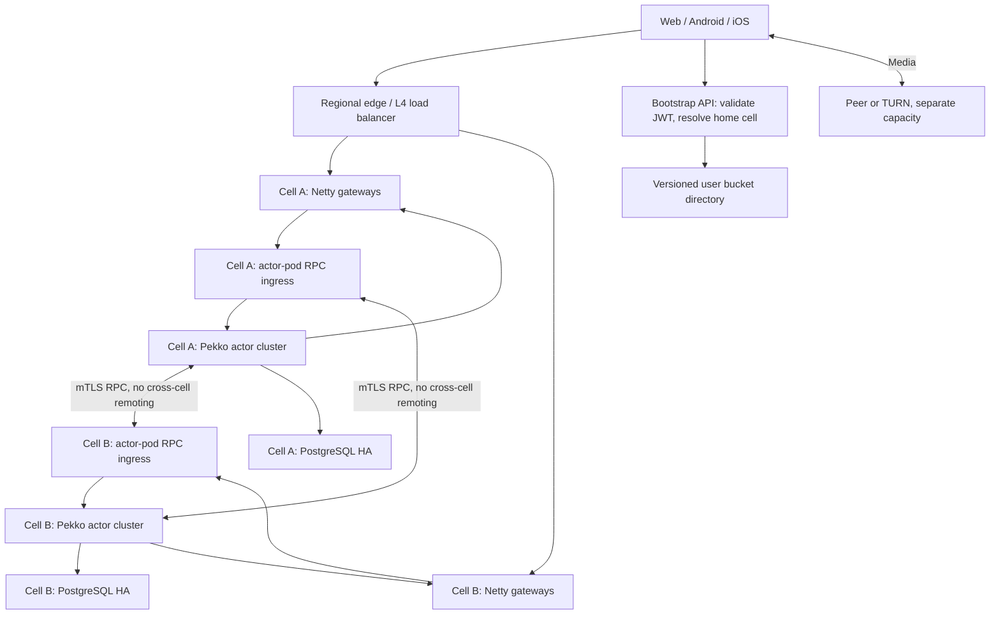
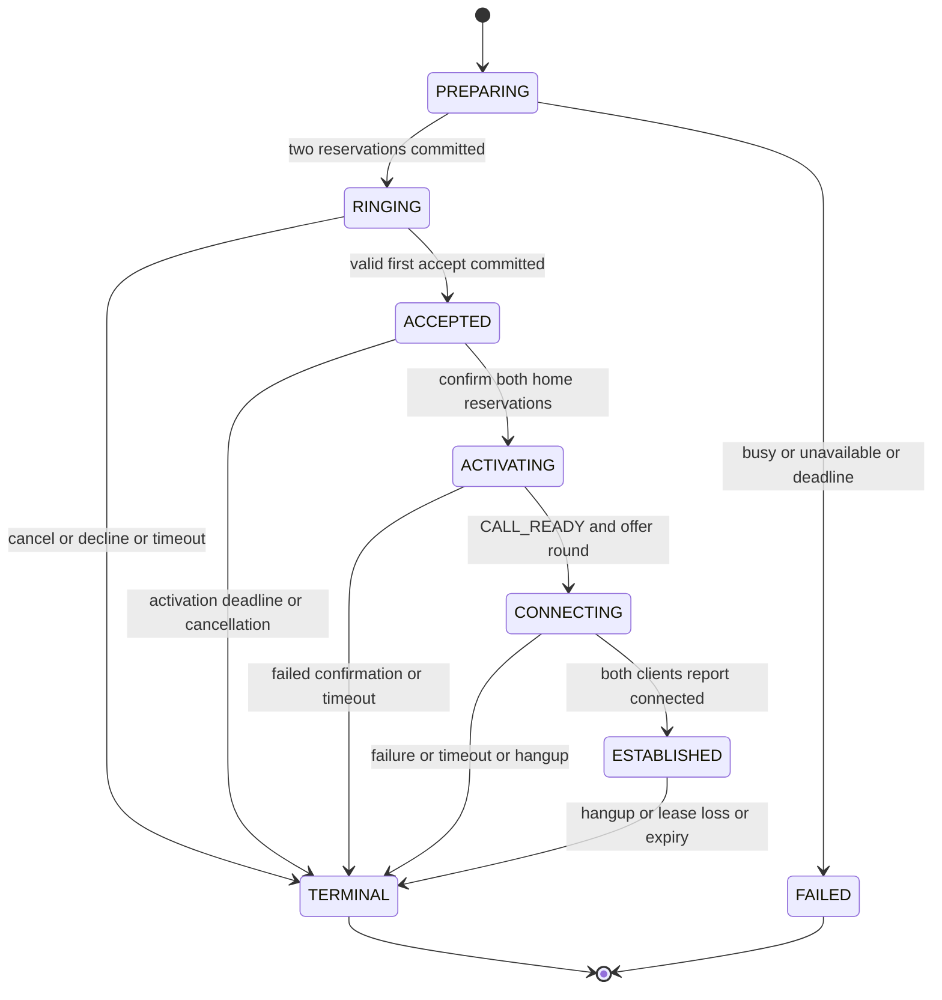

# WebRTC Signaling — 10 Million Concurrent Connections

**Date:** 2026-10-03 · **Version:** 1.11 · **Status:** Production-standard target specification; implementation, benchmark, fault-injection, security, and release qualification remain mandatory before production certification.

**Revision 1.1:** The entire specification is in English. JWT authentication explicitly uses RS256: the existing user service signs tokens with its RSA private key, and signaling verifies signatures with the corresponding RSA public key. Session identity remains `jti`.


**Revision 1.2 — System-design review:** Strengthens consistency boundaries, storage-side fencing, cross-cell saga recovery, generation retention, isolation, workload accounting, SLI definitions, disaster recovery, security, and operational readiness. Sections 22–33 record the review and normative additions. All numerical limits remain proposed defaults until measured; no implementation or 10M load-test evidence is claimed.


**Revision 1.3 — 10M/high-throughput production review:** Defines simultaneous connection/throughput qualification profiles; removes the short directory lease from steady-state cell authority; removes redundant UserActor ownership renewal; makes idle-user passivation the default; aligns heartbeat/reconnect deadlines; specifies relay authorization, runtime budgets, database physical design, and reproducible benchmark evidence. These are design changes, not measured performance results.


**Revision 1.4 — Mandatory non-blocking runtime (historical; database choice superseded by v1.8):** This revision selected R2DBC-only runtime SQL. The approved v1.8 contract permits blocking JPA/JDBC only in admitted, bounded database virtual-thread tasks; Netty event loops and actor dispatchers must still never block. Section 40 now states that current contract.


**Revision 1.5 — Safety and tail-latency review:** Makes INVITE transaction count explicit; distinguishes home winner arbitration from coordinator acknowledgment; adds post-commit immediate outbox dispatch, relay latency SLOs, queue-age admission, physical RPC connection isolation, renewal sequence fencing, and lease-aware database failover behavior. All changes preserve 10M CCU, the P2 proposed workload, RS256, non-blocking runtime, and datastore authority.

**Revision 1.6 — Adversarial lifecycle and readiness review:** Prevents gateway-lease resurrection and delayed home-saga acquisition after release; scopes idempotency to its authoritative store; specifies proactive CallActor recovery, clock-uncertainty handling, framework-buffer/completion budgets, and the added retention/maintenance workload. Section 44 separates resolved design gaps from evidence still required. No code, benchmark, or production certification is implied.

**Revision 1.7 — Selected database-performance architecture:** Replace per-call renewable owner rows with datastore-fenced ownership groups aligned with CallActor shards; retain per-user reservation leases. Select shared group/call barriers, durable group pulse sequences, compact authoritative replay history, bounded asynchronous detail export, and measured per-cell sizing. Section 45 defines the new contracts and qualification. Earlier numerical owner-renewal totals are historical unless explicitly labeled current.

**Revision 1.8 — JPA/virtual-thread boundary and database implementation review:** Select Spring Data JPA/Hibernate with pgJDBC for maintainability, using explicit native SQL/projections for authority and high-churn paths. Entire short transactions run on admitted database virtual threads; Netty/Pekko callers remain asynchronous. Sections 40 and 46 define COMMIT ownership, fresh snapshots, ORM-cache exclusion, query/index and constraint contracts, class-isolated pools, cancellation/unknown-outcome accounting, hotspot containment, retention/vacuum and release evidence. This replaces R2DBC-only access, not safety or 10M/P2 targets. Comparable R2DBC performance is a hypothesis to benchmark, not a guaranteed percentage.

**Revision 1.9 — Pekko Cluster Sharding runtime and ownership bridge:** Section 47 selects actor-pod RPC ingress, per-cell bootstrap/discovery, explicit ddata placement metadata, bounded allocation/recovery, a PostgreSQL-backed public Pekko Lease adapter and runtime/shutdown contracts. The adapter must acquire and COMMIT group authority before CallActor creation, so cold INVITE adds one COMMIT (same-cell two; cross-cell four). Previously acquired empty shards stay warm within the fixed group budget. Recovery first uses a bounded nonauthorizing routing hint, then performs authoritative hydration after acquisition. Sections 3, 7, 16, 24, 33, 42, 45 and 46 are aligned. These are reviewed specification requirements; implementation and measured 10M/P2 qualification remain open.

**Revision 1.10 — HA, recovery and routing precision:** Section 48 distinguishes framework shard/coordinator failover from application state, timers and reliable business outcomes; qualifies steady cached routing as expected near-constant lookup rather than a universal O(1) latency guarantee; and selects SBR stable-after10s/down-removal-margin10s for the six-member plus one-surge baseline. Sections 7, 11, 30 and 47 are aligned. The ≤30s recovery objective includes membership delays, ownership availability and hydration/lease validation; expired workflows terminate safely. The 10M/P2 target and bounded JPA/VT isolation remain unchanged.

**Revision 1.11 — Production-standard closure:** Section 49 closes the remaining design-level production gaps without claiming measured capacity. Trickle ICE now has ordered, duplicate-hidden delivery to the ICE implementation and generation-scoped end-of-candidates semantics; authorization and revocation have explicit fail-closed interfaces and bounded revocation objectives; workflow convergence is separated from active-call preservation; media/ICE failure and restart semantics are explicit; privacy/deletion and sensitive telemetry have lifecycle rules; database HA, directory authority and the PostgreSQL-backed Pekko Lease adapter have concrete release contracts; and the release gate requires simultaneous P2/N−1/24h performance, security, chaos, restore, migration and rollback evidence. Existing cell, Pekko, PostgreSQL, JPA/virtual-thread, outbox and fencing decisions remain unchanged unless Section 49 explicitly supersedes them.

## 1. Goals and Scope

Build a signaling service for 1–1 WebRTC calls using Java, Spring Boot, Netty, and Apache Pekko Typed Cluster Sharding. The existing user service issues RS256 JWTs. Signaling verifies signatures and required claims locally using the corresponding RSA public key, without per-request token introspection. A user can have multiple devices/sessions; each session corresponds to one `jti`. Calls ring on multiple sessions, and the first committed callee-home winner claim fixes the winning device; coordinator commitment confirms that decision.

Ten million CCU means ten million authenticated WebSocket connections, including idle connections. It does not mean ten million concurrent calls or ten million requests per second. Media bypasses Netty/Pekko: clients communicate directly or through TURN. STUN/TURN is a separate dependency with its own capacity, credentials, and SLOs. Group calls, SFU, recording, billing, and chat history are outside this version.

**Selected assumptions:** A user can participate in only one call being established or already active; at most five online sessions per user; only one accepted socket per session at a time. The initial region serves 10M CCU across three availability zones. Future regions use user home-region routing, without a Pekko cluster spanning regions. Offline users return `USER_UNAVAILABLE`; mobile push is a separate extension and is not assumed to exist.

The capacity figures, timeouts, and SLOs below are design targets requiring benchmarks, not load-test results. Section 35 defines the P0/P1/P2 qualification profiles; the earlier 1,000-attempt/s example is P1, not the complete high-throughput target.

## 2. Alternatives and Decisions

| Approach | Advantages | Costs and Risks | Decision |
|---|---|---|---|
| Independent cells with separate gateway and actor deployments | Scale different resource profiles independently; contain failures; keep clusters small | Requires a directory, cross-cell RPC, and migration procedures | Selected |
| One Pekko cluster containing every gateway and actor | Simple internal routing at small scale | Large membership, rebalance, remoting, and failure domains; sockets do not migrate with actors | Not used at 10M |
| Stateless gateway routing through Redis/broker without actors | Simplifies cluster membership | Requires custom ownership, concurrency, and state machines; does not follow the requested Pekko approach | Not selected |

Use one Maven multi-module codebase with several deployment profiles. Spring Boot provides lifecycle management, DI, configuration, WebFlux administrative/bootstrap APIs, and observability. Netty event loops and Pekko dispatchers never block; deliberately blocking JPA/JDBC is isolated in bounded virtual-thread tasks under Section 40. Netty owns WSS transport. Pekko owns entity routing and state machines. Production planes run in separate JVMs/pods.

Redis is not required for correctness. Add per-cell PostgreSQL as the authoritative store for session registration, user reservations, and call control state. Per-cell Redis is only a cache/rate limiter; losing it must not lose an acceptance decision. Keep Scylla/Kafka outside the hot path; audit/history can later use an asynchronous sink.

## 3. High-Level Architecture



Each cell has its own gateway deployment, actor deployment and database. The internal gRPC ingress runs in each actor pod/JVM and shares that pod's one ActorSystem; the diagram separates logical functions, not deployments. Gateways do not join the Pekko cluster: ingress uses typed EntityRef routing after authenticated bounded admission. Gateways receive outbound traffic through multiplexed RPC streams per gateway/process, not one RPC connection per user. Actor nodes within a cell join the same cell-scoped cluster; only the actor plane has cluster membership. Section 47 fixes registration/bootstrap and runtime contracts. The edge must also be partitioned and benchmarked; do not place all 10M sockets behind a single proxy.

Cross-cell RPC goes directly to the destination ingress through service discovery/cache, rather than through a global router for every message. Do not eagerly connect every node to every other node: maintain small, lazy channel pools per destination cell with bounded streams and queues. The caller's home cell owns the CallActor; the callee's socket and UserActor stay in the callee's home cell.

**Starting a call does not move sockets.** A socket remains on its original gateway; an actor may move between nodes independently. A gateway failure requires the client to reconnect and create a new socket.

## 4. Identity and Routing

| Value | Meaning and Invariant |
|---|---|
| `userId` | Identity from a validated JWT; selects the home cell and UserActor |
| `sessionKey = (issuer, jti)` | Session identity permanently bound to userId; the issuer prefix prevents collisions across issuers |
| `connectionId` | A new UUID for each socket; does not replace jti |
| `connectionGeneration` | Monotonically increasing value allocated by the authoritative session row on reconnect; fences older sockets |
| `gatewayId + gatewayBootId` | Process identity; a restarted pod must not reuse its bootId |
| `callId` | Server-generated ID containing coordinator cell ID and routing epoch; clients cannot select the coordinator |
| `callVersion` | Increases with each committed control transition |
| `negotiationId` | Server-issued identifier for each offer/answer round, including ICE restarts |
| `requestId` | Client UUID for retry/deduplication within commandScope; the same scoped ID with a different payload is rejected |
| `commandScope` | Server-derived `INVITE` scope at caller home, or `CALL:<callId>` at the immutable coordinator; never a client-selected authority |
| `directoryEpoch` | Version of the bucket-to-cell mapping; independent of connectionGeneration |
| `ownershipGroupId + ownershipHashVersion` | Immutable coordinator-local CallActor group; same extractor as the CallActor shard, independent of user buckets |
| `groupEpoch + leaseSequence` | Monotonic group takeover epoch and durable pulse cycle; no per-call renewal counter |

Home routing uses `bucket = stableHash(canonicalUserId) mod 16384`. A versioned directory maps buckets to home cells. These 16,384 logical buckets are not Pekko shards. Do not use `hash(userId) mod liveCellCount`, because adding a cell would remap users widely. The Pekko shard extractor uses a stable hash of the entity ID within the cell; initially propose 1,024 shards per entity type, subject to benchmarking.

`POST /v1/signaling/bootstrap` accepts a bearer token and returns the cell-specific WSS URL, supported protocol, directoryEpoch, and retry advice. The validated JWT userId determines routing; clients cannot arbitrarily select a cell. The gateway checks the mapping before session registration. Mapping cache refresh interval is at most 30 seconds while the directory is healthy. On outage, retain the last trusted mapping for known buckets; local persisted authority rejects stale routes and no cache entry grants mutation authority. A wrong cell returns application error `WRONG_CELL`, followed by reconnection to the correct endpoint; do not rely on browsers automatically following WebSocket redirects.

The directory is CP control data for provisioning and migration. Mapping changes require transactions/CAS and storage-side fencing; a cache is not the authority. The selected v1.3 policy is durable per-cell bucket authority, validated inside each local mutation transaction. It has no short timed directory lease. Existing ACTIVE buckets continue serving while directory quorum is unavailable; provisioning and migration pause. Cached bootstrap mappings may route existing buckets, and a stale mapping is rejected by a FROZEN source. Directory publication alone cannot enable a new owner. Section 24 defines the transfer barrier and Section 34 records why the v1.2 lease policy was replaced.

Bucket transfer must use the storage-side freeze/fence protocol in Section 24; application lease checks alone cannot fence a paused writer. Normal migration avoids forced cutover: freeze bucket admission, wait for call drain, copy required registrations, fence the old owner, publish the epoch, and reconnect clients. Gateways do not transparently migrate sockets. Active call coordinators do not migrate: wait for drain or deliberately terminate calls before moving the bucket.

## 5. RS256 JWT Authentication Lifecycle

### 5.1 Contract with the Existing User Service

The user service signs compact JWS JWTs using **RS256** and its RSA private key. Signaling verifies them using the corresponding **RSA public key**. Signaling never needs, stores, or uses the user service's private key, and does not issue or refresh user tokens.

RS256 means RSASSA-PKCS1-v1_5 signature verification with SHA-256. The number 256 refers to the hash, not the RSA key size. RSA keys must be at least 2,048 bits, as required by RFC 7518 Section 3.3. The actual deployed modulus size must be recorded in the benchmark configuration; this specification does not assume the existing key size has been inspected.

| Authentication Setting | Requirement |
|---|---|
| Accepted JWT algorithm | Exactly `RS256` |
| Signing component | Existing user service, using its RSA private key |
| Verification component | Signaling bootstrap API and Netty gateway authentication verifier |
| Verification key | Corresponding trusted RSA public key; at least 2,048-bit modulus |
| Required claims | `userId`, `jti`, `exp`, `iss`, `aud` |
| Additional supported claims/header | `nbf`, `iat`, `kid` |
| Session identity | `(iss, jti)` bound to userId; jti is not the key identifier |
| Network dependency per verification | None when the required trusted public key is cached/configured |

If existing tokens contain only userId/jti, add expiration and audience separation before production. `aud` must contain the configured signaling audience. Validate the configured issuer, expiration, and nbf when present; use a documented maximum clock-skew allowance, initially 30 seconds. Require nonempty, bounded userId/jti values. Identity is trusted only after signature and claim validation succeeds.

Pin the algorithm allowlist to `{RS256}`. Reject `none`, HS256, PS256, ES256, and other algorithms even if supported by the JWT library. Do not choose a verification algorithm from the token header alone. Do not use an RSA public key as an HMAC secret. Treat `kid` only as a bounded lookup identifier within the trusted RSA key set; never use untrusted `jku`/`x5u` headers to select an arbitrary key endpoint. Fail closed on invalid signatures, unsupported algorithms, incompatible key types, or invalid claims.

Baseline public-key distribution is a configured PEM RSA public key or trusted local public-key set. A configured trusted JWKS endpoint is an optional distribution/rotation mechanism; it does not introduce per-request introspection. For JWKS, accept RSA verification keys appropriate for RS256, check key usage metadata when present, and never import private key material.

Verify locally at the gateway and bootstrap API. Refresh keys in the background. For unknown kid, allow at most one rate-limited, single-flight refresh against the configured trusted endpoint; reject if no trusted matching key becomes available. For a single pinned key without kid, use only that configured key; a multi-key rotation profile requires unambiguous key selection, preferably kid. Old/new public keys overlap for the maximum remaining token lifetime plus clock-skew allowance. Emergency key retirement invalidates tokens signed with the retired key.

Use a bounded verification executor, queue, and timeout. Network key refresh and unbounded CPU-intensive RS256 verification must not run on Netty event loops. Benchmark RSA signature verification with the actual public-key size and JVM/provider. Verification occurs on authentication and token refresh, not on every authenticated signaling frame. Frames use the bound authentication context and current session/generation checks.

### 5.2 Browser and Native Transport

Browser WebSocket APIs do not allow arbitrary Authorization headers as ordinary HTTP clients do. The unified baseline is: WSS upgrade, unauthenticated state, then an initial `AUTH {token}` message within 5 seconds. Before authentication, only AUTH/close is allowed. Bound unauthenticated sockets and apply per-IP/TLS handshake limits to prevent socket exhaustion. Native clients may send a bearer header, using the same RS256 verifier. Do not place JWTs in URL query parameters or access logs.

Check an Origin allowlist for web clients. Native clients without Origin follow a separate policy; Origin is not identity proof. Return `AUTH_OK` only after successful local RS256 signature/claim verification and committed session registration under valid ownership. Authentication timeout closes the socket. JWT/security errors must not expose token contents.

Spring Security resource-server filters can protect the bootstrap HTTP endpoint, but they do not automatically protect a custom Netty WebSocket pipeline. Netty AUTH/AUTH_REFRESH handlers must explicitly invoke the shared RS256 verifier and enforce session registration. Configure RS256 explicitly rather than relying on library defaults.

### 5.3 Expiration, Refresh, and Revocation

The gateway sends `AUTH_EXPIRING` 60 seconds before exp. The client refreshes through the user service and sends `AUTH_REFRESH`; signaling verifies the new RS256 token using a trusted RSA public key. userId and issuer must remain unchanged. If the user service preserves jti throughout a session, same-jti refresh updates expiration with a version guard.

If the user service issues a new jti on every token refresh, that is a new session identity: atomically replace old/new session rows within the same cell database and preserve call binding through an explicitly confirmed transition. Do not assume two jti values identify the same session. The baseline requires the user service to preserve jti across refresh, matching the intended session semantics.

A transient refresh failure may be retried while the current token remains valid. At expiration, close the socket and remove signaling authorization; an invalid or malicious refresh may close it earlier. P2P media may continue; clients must implement the local policy. Public-key signature verification alone cannot reveal whether the user service has logged out, disabled an account, or revoked a session. Production therefore adds the Section 49 revocation plane: the identity service emits durable monotonic revocation events keyed by `(issuer,userId,jti)` (or an issuer/user security epoch for broad invalidation); each cell applies them to its local authoritative security state and actively closes matching sockets. Gateways may cache the latest applied epoch, but cache loss cannot make a revoked session valid. New critical commands fail closed when revocation freshness exceeds the configured security bound. Token expiration remains the ultimate fallback bound if the revocation plane is unavailable.

A stolen bearer JWT can still take over the same jti on reconnect: generation fencing invalidates the previous socket but does not prevent token theft. TLS, token lifetime, and client token protection remain required.

## 6. Session Registry and Presence

Do not create a persistent actor per socket. Netty maintains a local `connectionId → Channel` map. The UserActor, keyed by userId, holds up to five session routes and a reservation. Durable session rows are upserted on connection/refresh/disconnection, not on every ping.

The registration transaction takes the bucket barrier, locks the user session-limit guard and then the session row in the canonical order, verifies userId binding and a live gateway boot lease, increments generation, and sets `(gatewayId, bootId, connectionId, exp)`. Concurrent reconnects serialize in the database; the highest generation wins. A jti already bound to user X cannot register for user Y. At five sessions, return `SESSION_LIMIT`; do not silently evict another session.

After commit, invalidate the old generation on a best-effort basis. Correctness does not rely on immediate closure of the old socket. Every ingress command must be authenticated server-side against the session binding; client envelope userId/jti values are not authoritative. Critical control transactions check the current generation at the session home store. Noncritical relay permits bounded staleness and is checked again during delivery. The gateway checks connectionId/generation before writing.

Renew the gateway lease row every 5 seconds with a 15-second timeout, keyed by gatewayBootId, using one batch scheduler per gateway. A session is present when its token is unexpired, registration is not closed, and gateway lease is live. Socket heartbeat is local: ping every 30 seconds with jitter, pong deadline 10 seconds, edge idle timeout at least 90 seconds. Do not relay ping/pong to UserActor/database. Gateway lease expiration invalidates all routes of a dead process; cleanup uses lazy checks and bounded sweeps. Online presence may be stale up to the lease timeout; clients receive explicit unavailable/timeout results.

**An expired gateway boot lease cannot be renewed or recreated under the same bootId.** Initial boot creation is a separate authorized operation; renewals are conditional updates of a still-live row, with increasing renewal sequence and unchanged storage epoch. A duplicate renewal returns its original expiry; a lower sequence is rejected. A paused gateway checks its conservative local monotonic lease deadline before ingress/delivery and stops serving when it expires. Resuming requires a new boot identity and guarded re-registration of every retained socket, or bounded close/reconnect; changing bootId alone does not authorize existing channels. This prevents old routes becoming live again after another device took a freed session slot. Cleanup never turns a delayed renewal into INSERT. Account for lease-loss recovery as registration/auth churn, including the case where TCP remains connected.

Disconnect callbacks conditionally mark closed by sessionKey + generation + bootId; retain incarnation/generation tombstones as specified in Section 24 rather than deleting fencing identity; stale callbacks cannot remove a newer route. Restarted UserActors read registry/reservation state from the database and filter routes by lease. Cache is not authoritative; refresh once on routing failure, without unlimited retries.

## 7. Pekko Entity Model and Ownership

| Entity | Key | Responsibility | State |
|---|---|---|---|
| UserActor | userId | Session view, reservation/busy status, multi-device fanout | Actor cache; registry/reservations authoritative in the cell database |
| CallActor | callId | State machine, winner selection, deadlines, negotiation, control events | Durable control state/versions in coordinator database; bounded volatile ICE buffers |
| Local GatewayDirectory component | gatewayId/bootId | Stream liveness and outbound routing | Process-local cache checked against gateway leases |

Use typed messages and versioned serializer schemas, not Java native serialization. Never send Channel, ByteBuf, or Spring beans through remoting. Copy/retain/release ByteBuf according to lifetime before handoff; immutable DTOs contain only necessary payloads. Netty/Reactor/RPC event loops and actor dispatchers must never block. Under the approved v1.8 contract, JPA/JDBC and pool acquisition may block only inside explicitly admitted, bounded database virtual-thread tasks; HTTP clients remain asynchronous. Follow Sections 40 and 46 for transaction/COMMIT ownership and immutable completion commands. Keep one critical state mutation in flight per entity to avoid reordered completions and a bounded admitted stash. Already-authorized relay uses committed state while unrelated database work is pending; Section 42 defines the gate.

Actor location is an optimization, not sufficient fencing. Cluster Sharding does not automatically persist business state, and ordinary messaging does not guarantee exactly-once delivery. Critical control therefore uses transactions and idempotency, acknowledging after commit. SBR resolves cluster membership partitions; database fencing protects writes while an old owner has not stopped. HA also requires explicit typed supervision/recreation and durable-state hydration; failover does not copy actor RAM or replay every in-flight message. Section 48 defines framework versus application responsibilities and routing-cost limits.

CallActors use one renewable group_owner row per acquired shard ownership group, including an empty warm shard, aligned with their stable CallActor shard; there is no renewable owner row per call. Group TTL remains 15s with renewal every 5s, managed by the bounded PostgreSQL-backed Pekko Lease adapter/controller on the process hosting that shard (§47). Ownership token is (cell/storage epoch, ownershipHashVersion, groupId, groupEpoch, ownerIncarnation); a durable group leaseSequence advances on each successful pulse. UserActors retain guarded session/reservation transactions without a separate owner lease. Coordinator mutations hold the shared group barrier, validate the current primary group row and expected token/live lease, and serialize call changes through the call barrier/CAS until commit. Group takeover/release takes the conflicting exclusive group barrier. Home mutations retain user-guard/reservation protection. Section 45 defines sequence, cold acquisition, and recovery rules. No stale group owner can commit after takeover; different calls in a live group do not serialize on a group-row FOR UPDATE lock.

When the database is unavailable, control fails closed; Redis is not a fallback owner. Socket side effects originate from committed outbox events carrying callVersion/eventId. Retries may duplicate events; clients deduplicate them. Zero stale relay is not promised during partition detection: SDP/ICE carries negotiationId, and clients resynchronize after ownership changes.

Active CallActors do not idle-passivate; explicitly disable inappropriate automatic idle passivation for the CallActor entity type. UserActors are rehydratable caches/workflow facades and passivate after a proposed 60s without relevant traffic, even if the user still has live sockets or a durable reservation. Never discard an in-flight mutation while passivating. Use ClusterSharding.Passivate with bounded handoff, and configure an independently measured active-cache limit. Do not enable remember-entities for every user who has logged in. Session presence lives in registry/gateway leases; durable reservation renewal/recovery is independent of UserActor residency. Terminal calls retain tombstones/idempotency results for 24h and passivate after 2min. Application transactions are the control persistence mechanism; there is no second Pekko journal authority.

Select remember-entities=off for both entity types and state-store-mode=ddata for placement metadata. PostgreSQL-driven recovery explicitly wakes nonterminal CallActors; shard relocation alone does not recreate silent entities. A bounded scheduler discovers affected group_owner node/incarnation ranges and reads at most one existing nonterminal callId per affected group as a nonauthorizing routing hint. Sending idempotent WakeCall(callId) starts/routes the shard; its public Lease adapter must acquire and COMMIT authority before entity creation. The newly verified host then enumerates active calls by group and stable callId pages and hydrates them after fresh guarded reads. Duplicate wakeups do not create authority. CallActor rehydration does not write a new per-call owner row or reset the durable group sequence. Restore timers, renewals, compensation, and terminalization without client traffic. Full-cluster restart rebuilds from active-group/call indexes, not session registry or terminal history. Lost hints are repaired by bounded sweeps; business state remains solely in PostgreSQL. Section 47 defines this sequence and bounds.

## 8. Call Flow and Cross-Cell Reservations

### 8.1 Invite

1. Caller sends `INVITE {requestId, targetUserId}`. Gateway attaches validated identity, current incarnation/generation, and deadline.
2. At caller home/coordinator, dispatch creation to the CallActor on the assigned shard host after selecting callId; its group controller establishes authority. One transaction then validates current session/allow-call policy and current grouped ownership, acquires the caller reservation, and writes PREPARING + immutable group assignment + command-result handle. Duplicate requests return the recorded workflow. Cold group acquisition is merged only under the exclusive-from-start contract in Section 45; otherwise its extra commit is measured separately. Authentication does not grant unrestricted calling rights.
3. For a remote callee, one idempotent home transaction acquires its reservation and returns the offered live routes with identity/lease information. No caller database transaction remains open during RPC. Caller-first logical acquisition with fail-fast home checks is selected; reciprocal calls may both fail under contention and retry with jitter. Local database rows are still locked in canonical order. This is a saga, not cross-cell locking.
4. Once the remote reservation succeeds, a caller/coordinator transaction commits RINGING, the result, and outbox events. It validates current caller authority and the fresh remote reservation proof. Publication occurs only after commit; callee fanout is at most five. A registering session can be offered while RINGING under a guarded coordinator transition.
5. If either home has no eligible live route, returns busy, or cannot be reserved within the deadline, terminalize/compensate conditionally. Ambiguous remote outcomes are queried with the original operation identity; neither timeout nor actor ask failure means rollback is known. RINGING expires after 30s.

For a same-cell pair with ready grouped ownership, use the single-database atomic fast path in Section 42: current session validation, both user guards/reservations, group/call authority validation, call/result/outbox writes, and RINGING commit share one transaction. No intermediate PREPARING row must be externally visible. No per-call owner row is inserted. Cold group acquisition and cross-cell failure recovery follow Section 45.

This is a saga, not distributed ACID. PREPARING reservations have 15-second leases renewed every 5 seconds; crashes between steps are retried by callId or cleaned up on lease expiration. RINGING/ESTABLISHED reservations use 30-second renewable leases, renewed every 10 seconds by batched coordinator workers.

A new user reservation must check the authoritative home-database lease. The coordinator stops authorizing control if renewal is not confirmed before a 5-second safety margin relative to the earliest participant reservation expiration. On lease loss, terminalize the call and release the other reservation. Terminal delivery may be delayed by partitions. The one-call-per-user invariant applies to authoritative live reservations; it cannot ensure old P2P media immediately stops. Partitions exceeding lease timeouts can fail calls; avoid leaving users indefinitely busy.

### 8.2 Multi-Device Acceptance

The callee home service verifies current session generation, target-user membership, and authorization for ACCEPT. It atomically claims the reservation winner jti/generation using CAS on callId + reservationVersion and issues an internal acceptance proof with an expiration of at most 5 seconds. The coordinator accepts it only through trusted mTLS RPC, never a client-created proof. The home reservation cannot grant a second winner for the same call.

The coordinator transaction performs CAS `RINGING → ACCEPTED`, validates the proof, and records the winning session and callVersion. ACCEPTED records a durable winner decision, not permission to start media. The activation barrier in Section 25 must complete before publishing CALL_READY; the first committed home claim determines the candidate; the coordinator records only that immutable candidate. Other sessions receive `ANSWERED_ELSEWHERE`; the winner retrying the same requestId receives the existing result.

If the home claim succeeds but the coordinator crashes before commit, retry that same claim; do not choose another winner. If cancellation/deadline has already committed, reject acceptance and conditionally release the home claim. Authorization checked before proof expiration can complete after a reconnect race. A winner bound to an older generation must rebind through valid RESUME before relay; the old socket does not regain access automatically.

REJECT on one device rejects only that device. The call becomes DECLINED only when every offered session rejects. `DECLINE_ALL` is a separate user-level command that terminates by CAS. After CALL_READY, the caller creates an offer; SDP is not fanned out to all ringing devices.

### 8.3 SDP, ICE, and Establishment

Only after the activation barrier publishes CALL_READY, the caller is the initial offerer; the winning callee returns the answer. CallActor issues negotiationId and validates participant/state. Trickle ICE carries `negotiationId`, `iceGeneration`, `candidateSequence`, `sdpMid`, `sdpMLineIndex`, and `usernameFragment` when available. `iceGeneration` is bound to the negotiated ICE username fragment/password generation and changes on every ICE restart. For each `(callId,negotiationId,iceGeneration,sender)`, the signaling/client receive path presents candidates and the end-of-candidates marker to the local ICE implementation exactly once and in sender sequence order. Network/signaling retries are deduplicated before `addIceCandidate`; a bounded reorder window buffers gaps, requests bounded retransmission, and triggers `RESYNC_REQUIRED`/ICE restart if the gap cannot be repaired before its deadline. Candidates from stale generations are dropped before they reach the ICE implementation. Clients also buffer candidates arriving before the remote description under the same count/byte/deadline limits. `END_OF_CANDIDATES` carries the same generation and a terminal sequence; after it is accepted, later candidates for that generation are ignored and a new candidate requires a new ICE generation. Initial negotiation timeout is 20 seconds.

The server does not interpret ANSWER as proof of connected media. Clients send `MEDIA_CONNECTED` based on RTCPeerConnection state; once both report it, control state becomes ESTABLISHED. This is client-reported state, not proof of media quality. Established calls do not relay media or generate per-socket actor heartbeats.

Only one renegotiation round is in flight. A client sends NEGOTIATE_REQUEST; CallActor grants offer permission/negotiationId to one side, while the other receives `NEGOTIATION_BUSY` and retries with jitter. An ICE restart uses a new round; candidates from old rounds are not mixed. Mute/camera toggles are signaling metadata and do not require SDP changes unnecessarily.

### 8.4 Termination and Release

HANGUP/CANCEL/timeouts compete using expected callVersion/CAS. Terminal state is absorbing and cannot return to active. Commit terminal state and outbox before replying. Conditionally release reservations by callId + reservationVersion, with background retries. Delayed callbacks/releases from an old call cannot remove a newer call's lock. CANCEL before acceptance becomes CANCELED; hangup after acceptance becomes ENDED. Proposed maximum call duration is 8 hours, with reservation renewal throughout; do not depend on actor idle timers.

## 9. State Machine and Invariants



TERMINAL reasons include `ENDED`, `CANCELED`, `DECLINED`, `TIMED_OUT`, `FAILED`, and `UNAVAILABLE`. Signaling reconnection is a participant transport substate; it does not reset call state.

Required invariants: one accepted winner per call; one active reservation per user; one current generation per session; sender identity comes from authentication context; only the caller session and winning callee session exchange SDP/ICE; old generations cannot initiate authorization for new critical commands; commands authorized before reconnect may complete according to their recorded linearization point; terminal state cannot reopen; stale actors cannot commit; old releases cannot delete new reservations; retries cannot create extra calls; cross-cell timeout does not prove a command failed to commit.

## 10. Wire Protocol and Delivery

Use WSS subprotocol `webrtc-signaling.v1`. The baseline is JSON with a strict schema and Protobuf for internal RPC. Bound string lengths, nesting, and frame aggregation before parsing. Initially disable permessage-deflate to reduce CPU/memory and decompression-bomb exposure. A binary protocol version may be added after benchmarking without changing semantics.

```json
{
  "v": 1,
  "type": "ICE_CANDIDATES",
  "requestId": "a6f15c98-5308-434b-a4ef-5aa4c92c7bce",
  "callId": "c017.e3.01EXAMPLE",
  "negotiationId": 2,
  "payload": {"candidates": []}
}
```

Client identity fields are not authoritative. Server envelopes include eventId, callVersion, sessionIncarnation, connectionGeneration, negotiationId where applicable, serverTime, and result/error. `ACK_COMMITTED` proves server control-command commitment, not peer receipt. `EVENT_RECEIVED` is a peer application receipt, not proof of connected media.

| Command Group | Delivery and Retry |
|---|---|
| INVITE, ACCEPT, CANCEL, HANGUP, DECLINE_ALL | Durable idempotency by issuer+jti+commandScope+requestId; result retained at least 24h after final outcome and throughout a pending workflow; payload hash; bounded retry backoff; at-least-once outbox |
| OFFER, ANSWER | Bounded 30-second buffering/retry by callId+negotiationId+sender+requestId; process restart may lose payload; resync creates a new round |
| ICE_CANDIDATES / END_OF_CANDIDATES | Batch at most 20 candidates/8 KiB; generation + sender sequence; bounded resend/reorder for at most 10 seconds; signaling duplicates are hidden so the receiving ICE implementation observes each candidate/end marker exactly once and in order; an unrepaired gap or generation loss requires RESYNC/ICE restart |
| RESUME, SYNC_CALL | Return authoritative snapshot, current winner binding, and negotiation state; do not arbitrarily replay old SDP |
| AUTH_REFRESH | RS256 verification followed by expiration update with generation guard; retrying the same token is idempotent |

Initial limits: JWT 8 KiB; SDP 64 KiB; complete frame 80 KiB; ICE candidate 2 KiB; cumulative ICE 256 KiB and 256 candidates per participant/round. Error codes: `UNAUTHENTICATED`, `TOKEN_EXPIRED`, `WRONG_CELL`, `SESSION_REPLACED`, `SESSION_LIMIT`, `USER_BUSY`, `USER_UNAVAILABLE`, `CALL_NOT_FOUND`, `FORBIDDEN`, `STALE_NEGOTIATION`, `INVALID_STATE`, `RATE_LIMITED`, `OVERLOADED`, `RESYNC_REQUIRED`, `OUTCOME_UNKNOWN`, `IDEMPOTENCY_CONFLICT`, `RESULT_EXPIRED`, `ACTIVATION_FAILED`, `SELF_CALL_NOT_ALLOWED`, `RETRYABLE_CONFLICT`. `ACCEPTED_PENDING_ACTIVATION` is a successful intermediate status, not an error.

The durable outbox stores control metadata, not every ICE/SDP payload. Clients deduplicate by eventId and enforce monotonic callVersion; different eventIds may share one callVersion and must not be dropped merely because the version is equal. A late event strictly older than the snapshot cannot reverse state. Ordinary actor sends and internal RPC may be lost or duplicated during failures. Idempotency recovers critical effects; exactly-once network delivery is not claimed.

Internal RPC deadline is 2 seconds for control and 1 second for relay; allow at most two retries within the total budget using exponential backoff/jitter. One layer owns retries to avoid multiplication; Section 42 requires propagation of one remaining operation budget. Clients retry control for at most 30 seconds with the same requestId, then SYNC_CALL. An INVITE outcome timeout always triggers a result query before generating a new ID.

## 11. Reconnection, Actor Failover, and Partitions

Clients reconnect using full-jitter exponential backoff from 0.5 to 30 seconds, respecting server Retry-After. Registering the same jti increments generation. SYNC_CALL verifies the authenticated user, winning jti, and current generation, then rebinds the participant route through a committed transition. Another session of the same user cannot automatically take over an active call.

A reconnecting participant receives a proposed 75-second durable grace period from server-observed route loss, covering up to 40s client heartbeat detection plus reconnect/backoff; afterward end the call and release reservations. If media remains active, the client continues during grace without unconditionally resetting PeerConnection. If failover loses the SDP/ICE round, start a new negotiation/ICE restart.

| Failure | Required Behavior |
|---|---|
| Gateway crash | TCP connection is lost; route leases expire within 15 seconds; clients reconnect with new generations; old closure cannot delete new routes |
| Actor node crash | After safe membership/downing resolution, shards can relocate; acquire group authority, rehydrate committed control, rebuild timers and resume durable outbox. Bounded WakeCall recovery is required with remember-entities=off; see §48 |
| Actor network split | SBR keep-majority with proposed stable-after10s and down-removal-margin10s (§48) for the three-AZ baseline; database ownership CAS/leases fence stale owners; control is unavailable where fencing cannot be maintained |
| Cell database unavailable | Existing media continues; new control fails closed; keep bounded queues and return retry guidance; never claim uncommitted acceptance succeeded |
| Cross-cell RPC timeout | Remote commitment is unknown; retry the same ID/query state; clean up PREPARING leases |
| Redis unavailable | Conservative local rate-limit fallback; database correctness remains; reduce admission to prevent quota bypass |
| Directory unavailable | ACTIVE local bucket authority remains valid; serve known/cached mappings; freeze provisioning/migration; unknown bootstrap mapping returns retryable failure |
| One AZ lost | Remaining two AZs retain quorum/database availability and handle the planned load; reconnect uses admission/jitter |
| Entire cell lost | That cell loses signaling; do not redirect to an empty cell and grant parallel state; controlled failover follows fencing/restore |

SBR does not replace a quorum-capable database deployment. Database failover requires primary fencing and synchronous replication of critical commits to a standby in another AZ. Read/write the authoritative primary; do not use lagging replicas for generation, acceptance, or busy checks. One cell's PostgreSQL failure must not collapse the entire region while directory/control dependencies remain available.

A region outage does not promise call continuity: media may survive, but signaling recovery depends on separately designed home-region failover and state replication.

## 12. Storage Schema and Transactions

Minimum PostgreSQL tables:

- `session_registry(issuer,jti PK,user_id,session_incarnation,connection_generation,gateway_id,boot_id,connection_id,token_exp,closed_at,updated_at)`: unique session binding, user_id index, gateway-process lease check.
- `cell_authority(singleton_id PK,cell_id,storage_epoch,ownership_mode,ownership_schema_version,status)`: local serving/promotion authority; restricted HA/migration writer.
- `bucket_authority(bucket_id PK,directory_epoch,status,recovery_epoch)`: preprovisioned local bucket admission/freeze authority; retained epochs.
- `user_guard(user_id PK)`: per-user session/reservation serialization; not a renewable owner.
- `gateway_lease(gateway_id,boot_id PK,lease_until,renewal_sequence,last_operation_id,last_granted_expiry,storage_epoch,region,cell)`: boot expiry is irreversible; bounded boot-level sweeping.
- `user_reservation(user_id PK,call_id,reservation_id,reservation_version,winner_issuer,winner_jti,winner_incarnation,winner_generation,lease_until,coordinator_cell,coordinator_storage_epoch,ownership_hash_version,ownership_group_id,highest_group_epoch,highest_lease_sequence,last_renew_operation,last_granted_expiry)`: per-user authority and renewal replay state; no shared participant TTL.
- `group_owner(cell_id,ownership_hash_version,group_id PK,storage_epoch,group_epoch,owner_node,owner_incarnation,status,lease_until,lease_sequence,last_pulse_operation,last_granted_expiry)`: one durable ownership identity per logical CallActor shard; fixed group keys/epochs are retained even when idle.
- `call_state(call_id PK,ownership_hash_version,ownership_group_id,caller_user,caller_issuer,caller_jti,caller_incarnation,caller_generation,callee_user,winner_issuer,winner_jti,winner_incarnation,winner_generation,state,version,negotiation_id,activation_id,saga_phase,deadlines,last_mutation_group_epoch,terminal_reason,terminal_at,expires_at,updated_at)`: durable call control and compact terminal snapshot; last_mutation_group_epoch is provenance, not a renewable per-call owner.
- `command_result(issuer,jti,command_scope,request_id PK,authority_bucket_id,payload_hash,status,call_id,result,finalized_at,expires_at)`: INVITE scope lives at caller home; call-bound scope lives at the immutable coordinator; result and business mutation commit together. Persist the immutable local authority bucket for guarded replay retirement/migration without depending on a purged session row.
- `home_participation(call_id,user_id PK,acquire_operation_id,payload_hash,reservation_id,coordinator_identity,coordinator_storage_epoch,ownership_hash_version,ownership_group_id,highest_group_epoch,phase,winner_claim,activation_id,operation_results,terminal_at,expires_at)`: retained remote-home saga identity/replay history; heartbeat sequence stays in the current reservation row.
- `control_outbox(event_id PK,authority_bucket_id,call_id,version,destination,payload,delivery_state,dispatch_owner,dispatch_incarnation,dispatch_generation,dispatch_until,next_attempt,expires_at)`: unpublished-event index; insertion shares the state transaction; immutable local authority bucket selects dispatch barriers; exact claim identity fences late dispatch completion.

The registry lives in the session home cell, and call state in the coordinator cell. Do not assume cross-cell foreign keys or join transactions. Home acceptance proofs are a cross-database contract with bounded expiry and durable claims. Same-jti authentication refresh updates the home registry; call transitions check route/rebinding through trusted home services. Every home RPC carries callId, requestId/operationId, participation acquisition identity, reservation identity/version when known, coordinator identity/epoch, and deadlines. Compensation can reference the original participation before a reservation reply is known. Home services produce authorization proofs; gateways cannot issue them independently.

Critical transactions lock only relevant entity rows within one database, in a stable order; same-cell fast paths lock both user guards in sorted order. Unique constraints/CAS are the final protection; avoid check-then-insert outside a transaction. Resolve commit timeouts by querying the idempotency key. Outbox retries target only authorized participants; terminal-event retention is at most 24 hours. Use the latest call snapshot when destination reconnection requires resynchronization. Cleanup is chunked, avoiding deletion of millions of rows in one transaction.

Do not store raw JWTs, SDP, or ICE in baseline audit/logs. Idempotency and terminal retention are 24 hours; optional exported audit metadata retains 30 days and requires separate sizing. Database connection pools are fixed per pod under a total connection budget, not opened per socket. Benchmark lease renewal, WAL/replication bandwidth, locks, outbox fanout, and cleanup.

## 13. Capacity Model: 10M Connections

### 13.1 Workload Assumptions

| Variable | Example Value | Interpretation |
|---|---:|---|
| N | 10,000,000 | Authenticated sockets |
| C | 1,000 call attempts/s | Example design workload, not derived from CCU |
| D | 300 seconds | Average established-call duration |
| Success ratio | 100% example upper bound | 300,000 active calls = C × D; 600,000 media participants |
| S | 50 inbound signaling messages/call setup | Offer/answer/control and batched ICE; outbound fanout calculated separately |
| Churn | 0.02% sockets/s | 2,000 reconnect/auth registrations/s |
| Heartbeat | 30 seconds | Approximately 333,333 pings/s and 333,333 pongs/s, handled locally |
| Cross-cell fraction | Approximately 98% with 50 balanced cells | Size close to the worst case rather than assuming high locality |

Setup inbound traffic is approximately C×S = 50,000 messages/s. This excludes outbound fanout, actor hops, outbox, retries, reservation renewal, and recovery. At P1 A=300k, two reservations renewed every 10s require 60k user-row updates/s. Current grouped ownership adds G_leased/5; for 50 cells with 1,024 groups/cell this is at most 10,240 group-row updates/s, giving an illustrative established-call component of at most 70,240/s at full group occupancy. The previous per-call owner component of 60k/s is historical; transient workflows and other writes are additional.

Renewing ownership for 10M online UserActors every 5 seconds would require another 2M rows/s: **do not enable renewable database ownership for every idle UserActor**. Session-registry mutations use transactional row constraints/generations. UserActors never renew a separate business owner row; reservation guard/CAS transactions are authoritative for both idle and active users. Ownership-table cleanup must prevent unbounded churn.

Losing one of three AZs may trigger approximately 3.33M reconnects. Spreading them over 120 seconds still produces approximately 27,778 reconnects/s region-wide, excluding ordinary churn/retries. Separately benchmark the RS256 verification executor, TLS edge, registration WAL, and admission. Synchronized JWT refresh poses the same risk: jitter refresh within the permitted window without exceeding exp. Load tests must use actual RS256 tokens and deployed RSA modulus size; synthetic unsigned tokens do not measure authentication capacity.

### 13.2 Illustrative Cell and Gateway Sizing

Choose 50 cells averaging 200k sockets/cell. Assume a benchmark-validated target capacity of 25k sockets/gateway pod on a documented configuration. Deploy 15 gateway pods/cell, five per AZ. Normal load is approximately 13.3k sockets/pod; after one AZ is lost, ten pods handle 20k each, retaining 20% of the assumed 25k ceiling. This totals 750 gateway pods region-wide. It is a numerical example, not a pod count guaranteed sufficient by Netty.

Actual gateway capacity is the minimum of memory, TLS/parsing/RS256 verification CPU, NIC bandwidth/packets per second, file descriptors, outbound pressure, and edge/backend limits. Measure incremental process RSS/socket after warm-up for heap/direct/TLS/native allocations; account for kernel socket memory separately in host/cgroup totals. Kernel buffers are not part of process RSS. At 25k sockets, 32 KiB/socket is approximately 781 MiB; 128 KiB/socket is approximately 3.05 GiB, excluding JVM baseline and queues.

TLS termination placement determines edge/gateway memory and CPU. The baseline uses an L4 edge with gateway TLS termination to avoid routing all authentication through an L7 bottleneck. Validate edge conntrack, SNAT/port limits, and original-source-IP forwarding.

Initially trial six actor pods/cell, two per AZ. Production sizing depends on measured service rate/heap with active calls, online UserActors, and one AZ unavailable. The example has approximately 6k active calls/cell and five attempts/s per remaining actor pod after an AZ loss: 20 attempts/cell/s divided by four pods. Actual command/hop rates are much higher. Call attempts/s is not the only CPU proxy. Load-test 5× offered-load skew across cells/user buckets; reject excess traffic outside the validated envelope. Do not assume a 200k-socket cell can suddenly serve 1M sockets without additional measured capacity or planned bucket migration.

There is insufficient evidence to prescribe final vCPU/RAM or dependency versions. Pin a supported Java LTS, Spring Boot, Netty, Pekko, and serializer/transport BOM; perform interoperability/security validation before rollout. Do not use unpinned latest releases in production.

### 13.3 CPU, Bandwidth, and Row-Write Formulas

Gateway CPU seconds/s is approximately `authRate × rs256VerifyCpuSeconds + frameRate × parseCpuSeconds + TLS cost + heartbeat cost`. Measure rs256VerifyCpuSeconds using the actual RSA key size and JVM/provider. Wire bandwidth is the sum of payload, WebSocket, TLS, and TCP/IP overhead multiplied by message rate. NIC packet rate may saturate before bandwidth.

Assuming ping+pong total 200 wire bytes per cycle/socket, heartbeat traffic is approximately 66.7 MB/s or 533 Mb/s region-wide; ACKs/retransmissions add overhead. At 50k inbound messages/s × 1 KiB, payload bandwidth is approximately 51.2 MB/s; larger SDP, internal hops, and fanout increase it. Measure peak frame rates, payload-size percentiles, and candidate counts separately.

Admission limits apply per IP, user, cell, and regional recovery budget. Temporarily limit new calls during recovery; prioritize HANGUP/CANCEL/AUTH_REFRESH/RESUME over INVITE. Increasing socket timeouts does not solve insufficient capacity.

## 14. Backpressure and Memory Limits

Every queue has count, byte, and deadline limits: unauthenticated/authenticated ingress, verification executor, RPC channels, actor stash/mailbox, outbox delivery, and per-socket outbound. A bounded mailbox alone can dead-letter messages. Ingress credits/inflight limits must reject before enqueue with explicit errors, rather than waiting for mailbox drops. A large message must respect the byte budget even when queue count is low.

Suggested Netty write watermarks are 16 KiB low and 64 KiB high; monitor isWritable and writability callbacks. These are pressure signals, not hard memory caps. Initial per-channel outstanding outbound cap is 256 KiB, with an aggregate pending-outbound cap of 256 MiB/gateway. The high watermark must not imply permanent 64 KiB allocation for every idle socket.

When a channel is not writable, coalesce valid candidate batches, pause bounded upstream credits, and retain control events within deadlines. Exceeding limits or 10 seconds of sustained pressure closes the slow consumer with RESYNC_REQUIRED. Never drop HANGUP and report it delivered.

Separate control priority from ICE bulk quotas while preserving callVersion/negotiation ordering. One slow socket must not pause an entire shard. The bounded executor rejects authentication overload and closes the connection after a response where possible. Event loops do not block on database, DNS, HTTP, or large JSON validation. Marshal channel writes onto the event loop and define asynchronous payload lifetimes explicitly.

Example abuse limits: 30 frames/s/session with burst 60; at most 256 ICE candidates/participant/round; six INVITEs/minute/user and one concurrent call/user. These are abuse defaults, not throughput targets. Noisy callers cannot exhaust callee mailboxes; use fair per-user admission. Redis rate-limit failure enables conservative local limits plus a cell circuit breaker, not unrestricted fallback.

## 15. SLOs and Observability

Design targets measured under the documented workload and validated capacity with one AZ unavailable:

- API/signaling control availability: 99.95% for successful eligible operations. Exclude authentication/user errors under a published taxonomy; report OVERLOADED separately while still counting it as a server failure.
- Intra-region committed control acknowledgment: p95 at most 150ms, p99 at most 500ms; cross-cell measurements include home validation and database operations.
- Server relay completion: proposed p95 at most 50ms, p99 at most 150ms for the sampled same-origin-gateway timing contract in Section 42, with cache misses reported and included; client network/media is excluded.
- Invite-to-first-online-device application receipt: p95 at most 500ms, p99 at most 1 second, measured by client probes. Excludes push, human answer time, and media ICE latency.
- Gateway liveness expiration: at most 15 seconds; local socket failure detection is normally at most 40 seconds. Single-gateway reconnect recovery target: p95 at most 60 seconds from transport failure, including client detection and authentication. Mass AZ outage has a separate target of at most 180 seconds for 99% of eligible reconnects, subject to admission benchmarks.
- Safety: zero duplicate accepted winners or simultaneous authoritative reservations in tests; do not redefine these as probabilistic acceptance errors.

Metrics include active/auth-pending sockets, churn, RS256 verification latency/rejections/queue depth, TLS handshakes, event-loop lag, RSS/direct/heap/GC, pending bytes, non-writable duration, mailbox/stash/inflight depth, shard rebalance/recovery time, database pool/locks/WAL/replication lag, lease renewal failures, fenced writes, outbox age, cross-cell retries/errors, acceptance conflicts, negotiation timeouts, stale ICE, and reservation cleanup lag.

Do not use userId/jti/callId as Prometheus labels. Structured logs/traces contain sampled opaque callId/requestId; redact tokens and sensitive SDP/ICE/IP information. Synthetic two-client probes across sampled cell pairs measure end-to-end control. Dashboards distinguish server signaling latency, human answer time, ICE establishment, and media QoE.

## 16. Deployment and Operations

Kubernetes deployment uses anti-affinity/topology spread across three AZs, quorum-aware PDBs, and resource requests/limits accounting for direct memory. Actor-pod ingress, Pekko Management bootstrap and Kubernetes API discovery are cell-scoped; initial six-pod formation and normal join-only operation have separate profiles (§47). Discovery must see not-ready pods; the business RPC Service must select ready pods. Actor seed/discovery must not depend on one pod. Use internal mTLS/workload identity; never expose remoting/management ports publicly. Apply per-cell NetworkPolicies; gateways call only required ingress endpoints.

Gateway drain stops admission, marks readiness false, retains existing sockets for at most five minutes, sends jittered RECONNECT advice, then closes in batches. Match load-balancer deregistration and termination grace periods. Actor drain follows the §47 CoordinatedShutdown order with a proposed 90s pod grace period: shed ingress, settle admitted work, hand off shards/release exact group leases, leave the cluster, then close database resources. Continue required renewals until each group is handed off. Durable deadlines survive shutdown. Do not roll out every cell/AZ simultaneously.

Gateway HPA considers sockets, CPU, and pending bytes; actor HPA considers service rate, mailbox, and recovery. Pre-scale because adding gateways does not move existing sockets automatically.

Session authentication, registration, critical control, and outbox schemas support at least N/N-1 during rolling deployment. Use expand-contract database migrations and protocol version negotiation. Alert on insufficient post-AZ-loss capacity before accepting additional users. Use per-cell feature flags and one-cell canaries before expansion.

Per-cell database HA requires synchronous critical-commit replication and tested primary fencing/runbooks. Replicate directory authority across three AZs rather than using standalone Redis. Backup/PITR supports restoration but does not replace HA. Disaster restore invalidates all recovered nonterminal calls under a new recovery epoch; it cannot reopen old calls or grant parallel ownership (Section 30). Region failover requires a new routing epoch and fencing of the old home region; version 1 supports runbook recovery with interruption.

Distribute only RSA public verification keys to signaling deployments. Private signing keys remain exclusively in the user service's security boundary. Rolling public-key rotation must maintain validation overlap and include explicit retirement procedures.

## 17. Module Contracts and Interfaces

```text
signaling-protocol       DTOs, schemas, errors, idempotency contracts
signaling-auth          RS256 verifier, trusted RSA public-key cache, claim policy
signaling-gateway       Netty channels, local heartbeat, admission, outbound limits
signaling-cell-rpc      authenticated home proofs, ingress, multiplexed delivery
signaling-actors        UserActor, CallActor, shard Lease adapter/controller, bounded recovery
signaling-storage       JPA/JDBC services; native authority/CAS SQL; bounded DB virtual-thread admission
signaling-control-api   bootstrap, directory administration, health/readiness
signaling-observability metrics, tracing, redaction
```

Key interfaces: `ValidateToken`, `RegisterSession`, `RefreshSession`, `CloseSessionIfGeneration`, `ReserveUser`, `ClaimAccept`, `RenewReservation`, `ReleaseIfCallVersion`, `ExecuteCallCommand`, `ResolveHome`, `DeliverControlEvent`, `RelayNegotiation`, `SyncCall`. Every mutating RPC includes requestId, caller workload identity, expected generations/versions, and deadline. The public protocol does not expose administrative groupEpoch APIs.

Gateway and actor profiles use the same release but scale independently. The control directory is a small subsystem with stable interfaces; directory transactions are not mixed with the call hot path. No source repository was supplied, so this specification is a standalone artifact and does not assume these modules already exist.

## 18. Validation Plan and Acceptance Criteria

### Correctness

Model/state-machine tests cover every transition and terminal absorption. Race tests include at least 100 simultaneous accepts from five sessions, duplicate INVITE, ACCEPT versus CANCEL/timeout, reciprocal A→B/B→A calls, old disconnect after reconnect, refresh versus takeover, delayed reservation release, the same jti bound to different users, and stale actor commits. Property tests check Section 9 invariants under randomized schedules.

Kill processes before/after database commit and outbox delivery. Retries must return the committed result without creating another call. Partition an owner from the database/cluster, replace it, and deliver delayed completions; the old epoch must not commit. Test successful home acceptance claims followed by coordinator timeout/crash, new-generation resume, and client event deduplication. Primary failover must preserve acknowledged acceptance under the synchronous replication policy.

Authentication tests cover valid RS256 tokens, wrong RSA public keys, altered signatures/payloads, expired/nbf/issuer/audience failures, absent or malformed userId/jti, unsupported algorithms, algorithm-confusion attempts, undersized/incompatible keys, unknown kid floods, cached-key verification without network access, overlapping key rotation, and retired-key rejection. Both bootstrap and Netty AUTH/AUTH_REFRESH paths enforce the same policy. Confirm no private signing key or raw token is stored/logged by signaling.

### Capacity

Use distributed load generators across machines/IPs so source ports, generator CPU/NIC, and load balancers do not invalidate conclusions. One k6 machine does not prove 10M capacity. The harness maintains authenticated WSS connections, correct heartbeat, event parsing, and multiple jti values per user; simulated media is sufficient for signaling load. Separately test real browser/mobile WebRTC interoperability for SDP, ICE restart, and media establishment.

Gates: 10k → 100k → 200k/cell → multiple cells → 10M region-wide. Each gate uses the specified C/D/S/churn, real TLS and RS256 JWTs with actual deployed RSA modulus size, multiple sessions, cross-cell fraction, and skew. Soak for at least 24 hours including token expiration/refresh, terminal cleanup, and rolling deployment. Measure generator headroom.

At 10M, exercise P1 and the P2 high-throughput profile in Section 35 with heartbeat, refresh, control, relay, renewal, and cleanup simultaneously. The old 1k-attempt/s example alone does not qualify P2. Lose an AZ and test 3.33M reconnects/admission limits. Separately test setup/ICE bursts, slow consumers, malformed frames, unknown-kid floods, and synchronized RS256 token refresh. Report actual pod sizing, memory/socket, saturated resources, RS256 verification throughput, database row/WAL rates, and SLOs. Recalibrate if the real workload differs before claiming 10M capacity.

### Exit Criteria

No safety-invariant violations; queues remain within budget; no steadily increasing memory leak during soak; eligible control latency meets targets; acknowledged state survives node/database failover under policy; capacity remains sufficient with one AZ unavailable; reconnect storms do not collapse other cells; RS256-only enforcement and key rotation work; unknown/missing keys fail closed; recovery timers/outbox/cleanup converge.

Document limitations: media is outside the server-capacity claim; offline push is unsupported; region failover is not seamless. RS256 verification remains offline on the hot path, while production immediate logout/disable semantics use the separate bounded revocation plane in §49.2.

## 19. Proposed Implementation Sequence

1. RS256 JWT/public-key distribution, jti-refresh and §49.2 revocation/high-water contracts; protocol; single-cell Netty authentication, registry, generations and operation authorization.
2. User/CallActor state machines, database CAS ownership, reservations, outbox, PostgreSQL-backed Pekko Lease adapter, and correctness/model tests.
3. SDP/offer-answer plus §49.1 ordered generation-scoped Trickle ICE, reconnect/resync and media/ICE-restart semantics with browser/mobile interoperability tests.
4. Two cells: stable directory routing, home acceptance claims, cross-cell RPC, revocation propagation, and failure injection.
5. Backpressure, slow-consumer isolation, authentication/reconnect admission, leases, privacy lifecycle, observability and runbooks.
6. Pin database HA/directory/BOM; benchmark one cell with one AZ unavailable and verify safety/recovery/active-call-preservation gates.
7. Expand cells and execute §49.9: P0/P2, N−1/AZ loss, security, chaos, DR/restore, rollout/rollback and ≥24h soak; publish only the measured capacity envelope.

This is architectural subsystem sequencing, not a detailed implementation plan or deployment commitment. A codebase-specific plan follows specification review.

## 20. Architecture Self-Review

The design distinguishes socket/session/user/call; actors do not migrate sockets; there is no global actor or Redis PubSub fanout; authentication is local RS256 public-key verification without per-request introspection; expiration/audience/key rotation are explicit; generations fence reconnects; acceptance/home claims are durable; cross-cell reservations form a saga; ownership renewal does not scale with all idle users; local heartbeat avoids approximately 333k actor pings/s; outbox and relay have different delivery semantics; single-region 10M sizing includes one-AZ-loss assumptions and benchmark gates.

Trade-offs remain explicit: PostgreSQL/leases increase writes while protecting control correctness; one call per user simplifies busy semantics and requires reservations; actor partitions have grace periods without unlimited media/signaling continuity; bucket migration is a CP control-plane operation and existing ACTIVE authority is local; multi-device fanout is limited to five; bearer-session hijacking is not solved by jti alone. RS256 verification uses the existing user service's corresponding public key, with no private signing-key dependency in signaling.

## 21. Foundational References

Cell counts, schemas, local process/entity leases, sagas, timeouts, capacity, and SLOs are proposals in this specification. These references establish platform behavior; they do not demonstrate 10M performance.

- [Apache Pekko Cluster Sharding](https://pekko.apache.org/docs/pekko/current/typed/cluster-sharding.html): entity routing, rebalance, and passivation; sharding is not socket migration.
- [Apache Pekko Message Delivery Reliability](https://pekko.apache.org/docs/pekko/current/general/message-delivery-reliability.html): ordinary messaging is not exactly-once; application acknowledgment/idempotency is required.
- [Apache Pekko Split Brain Resolver](https://pekko.apache.org/docs/pekko/current/split-brain-resolver.html): membership partition strategies; business-state fencing remains a design responsibility.
- [Netty Channel](https://netty.io/4.1/api/io/netty/channel/Channel.html): asynchronous channel I/O and writability/backpressure signals.
- [Spring Security JWT](https://docs.spring.io/spring-security/reference/servlet/oauth2/resource-server/jwt.html): public-key decoding and claim validation; custom Netty AUTH handlers must invoke verification explicitly rather than relying on servlet filters.
- [RFC 7518, Section 3.3](https://www.rfc-editor.org/rfc/rfc7518.html#section-3.3): RS256 is RSASSA-PKCS1-v1_5 with SHA-256, verified using the corresponding RSA public key; minimum RSA key size is 2,048 bits.
- [RFC 8725](https://www.rfc-editor.org/rfc/rfc8725.html): JWT algorithm/issuer/audience validation and trusted-key policy.
- [RFC 9429](https://www.rfc-editor.org/rfc/rfc9429.html): JSEP, offer/answer, and ICE; supersedes RFC 8829.
- [RFC 8838](https://www.rfc-editor.org/rfc/rfc8838.html): Trickle ICE.


## 22. Review Findings and Resolution

Severity describes the risk in revision 1.1, not an observed production incident. BLOCKER means the previous text did not specify enough to preserve a stated invariant during an adversarial failure schedule.

| ID | Severity | Gap in revision 1.1 | Required resolution |
|---|---|---|---|
| R01 | BLOCKER | Directory lease checked in application memory does not prevent a paused old transaction from committing after bucket transfer | Storage-side freeze barrier; no forced promotion without old-store fencing (§24) |
| R02 | BLOCKER | Session-row deletion or owner-row recycling could reset fencing counters and admit delayed traffic (ABA) | Incarnation identity, generation tombstones, immutable issuer binding, recovery epoch (§24) |
| R03 | HIGH | Cross-cell winner claim, coordinator commit, reservation expiry, and media-start publication were not separated | Durable saga phases and CALL_READY activation barrier (§25) |
| R04 | HIGH | Owner lease validation and mutation could be separated, permitting takeover races | Conflicting authority barriers held through commit; v1.7 shared group/exclusive takeover barriers preserve fencing (§24, §45) |
| R05 | HIGH | Five-session limit depended on a guard absent from schema; winner stored jti without issuer | Explicit user_guard and full session keys (§24) |
| R06 | HIGH | Best-effort outbox delivery lacked receiver acknowledgment and poison-event recovery | Durable dispatch claims, deduplication, SYNC snapshot fallback, expiry handling (§26) |
| R07 | HIGH | Almost all calls cross cells; one cell's outage affects callers elsewhere | Quantified dependency blast radius; destination bulkheads/circuit breakers (§27) |
| R08 | HIGH | Directory was a region-wide short-lease dependency despite independent cell claims | v1.3 replaces short directory leases with durable local authority; quorum is needed for mapping changes (§27, §34) |
| R09 | HIGH | Lease writes, token refresh, idempotency retention, and recovery database growth were understated | Complete write/retention formulas and admission envelope (§28) |
| R10 | HIGH | Generic synchronous replication did not define WAL durability or eligible promotion | Remote durable WAL acknowledgment, primary fencing, no unsafe downgrade (§30) |
| R11 | MEDIUM | Availability and latency denominators, error budget, and client path were ambiguous | Explicit SLIs and separate service/media/transport SLOs (§29) |
| R12 | MEDIUM | Recovery, security incident behavior, cost, and operator ownership were incomplete | DR matrix, security contract, operational gates and ADR register (§30–33) |

## 23. System Properties and Consistency Contract

| Property | Required contract | Deliberate limitation |
|---|---|---|
| Scalability | Scale within measured per-cell bounds; add cells using stable buckets; independently scale gateways and actors | Existing sockets do not redistribute when pods are added |
| Safety | One winner per call; one live reservation per user; one current session route; terminal states absorbing | Old P2P media cannot be forcibly stopped by signaling |
| Consistency | Critical commands serialize on authoritative rows with CAS/locks and durable results | No globally serializable transaction spanning two cell databases |
| Availability | Three-AZ deployment tolerates the tested single-AZ loss with preprovisioned capacity | Critical control sacrifices availability during local datastore/CallActor owner lease loss |
| Durability | Acknowledged critical decisions survive one eligible primary/AZ failure under synchronous WAL policy | Volatile SDP/ICE rounds require renegotiation after restart |
| Ordering | Per-call committed callVersion is monotonic; relay uses negotiationId and sender sequence | No total order across users, calls, gateways, or cells |
| Liveness | Durable deadlines, sweepers, retry budgets, and compensation release abandoned reservations | Convergence requires eventual recovery of authoritative stores |
| Isolation | Bound cell size, destination concurrency, per-user queues, and resource pools | Calls depend on both participant homes and the coordinator |
| Security | RS256 verification, claim checks, session binding, per-operation authorization, bounded revocation plane, RPC authorization, bounded untrusted input | Revocation freshness and policy availability are explicit dependencies for new critical operations |
| Evolvability | Version protocol/serializers; N/N-1 compatibility; expand-contract migrations | Incompatible changes require an explicit migration and rollback plan |

The consistency claims are scoped to rows/aggregates: session registration linearizes at the home transaction commit; a user reservation is acquired at its home transaction commit; device arbitration linearizes at callee-home claim commit; the accepted call decision linearizes at coordinator call-state commit. They are distinct phases of a saga, not one global linearization point. Presence and caches are eventually consistent. A home authorization proof records a checked identity at a defined time and is not a distributed lock; a command authorized before reconnect may complete under that recorded decision. A new-generation reconnect requires RESUME to move the active participant binding.

The cross-cell saga can expose an intermediate winner decision while activation is incomplete. Clients must distinguish ACCEPTED from CALL_READY. This is not an atomic simultaneous acceptance across both homes. Lease expiry may make a coordinator's cached call look active after a home has released it; only current home reservations authorize control. The safety contract does not claim one globally visible ESTABLISHED row per user at every instant under partitions.

Retry state is `PENDING`, `COMMITTED`, or `TERMINAL_FAILURE`. Return `OUTCOME_UNKNOWN` for a transport timeout, not a definite rejection. The durable key is `(issuer,jti,commandScope,requestId)`. INVITE uses server-derived scope `INVITE` and is stored at caller home, which creates the coordinator call. Commands with an existing callId use scope `CALL:<callId>` and are stored at that call's immutable coordinator. A callee home stores participant-step replay state, not a competing coordinator result. There is no cross-database globally unique session/requestId constraint. Reusing a requestId across different call scopes is distinct work; within one scope, a changed command type or payload is IDEMPOTENCY_CONFLICT.

`GET_COMMAND_RESULT {requestId, callId?}` uses current authentication for the original issuer+jti. Without callId it resolves the INVITE scope at caller home; with callId it resolves the embedded immutable coordinator and call scope. INVITE outcomes can therefore be found before the client knows callId. Hash the canonical validated intent, including command type, scope, identities, and payload; exclude transport retry deadline, trace ID, and reconnect generation so a legitimate retry after reconnect does not change intent. Evaluate current read authorization separately. Return recorded results without rerunning effects. A result query timeout or an unresolved authority/migration returns OUTCOME_UNKNOWN, not authoritative absence. Do not issue a new INVITE ID to resolve ambiguity.

Keep results while their workflow is pending and for at least 24h after the recorded final command outcome. This is a finite deduplication window; it is not permanent request-ID uniqueness. Clients stop retries after the published 30s retry budget and query/synchronize within retention. After retention, return RESULT_EXPIRED when identifiable, never a fabricated failure/rollback; a genuinely new call requires fresh user intent and a new ID. A business failure is also retained so replay cannot change it into a successful call. Authentication/session tombstones have their separate security retention.

## 24. Storage-Side Fencing, Identity, and Transaction Rules

### 24.1 Identity and Retention

All participant/winner bindings use `(issuer, jti, sessionIncarnation, connectionGeneration)`; userId is canonical and issuer-qualified if more than one user namespace is supported. Define canonicalization and a fixed hash implementation with cross-language test vectors before routing is deployed. A callId embeds a coordinator identity/epoch for lookup but never grants authorization; use an unguessable random component.

Add `user_guard(user_id PK)` for session-count and reservation serialization; `bucket_authority(bucket_id PK, directory_epoch, status, recovery_epoch)` for local admission/freeze; and durable saga participant steps linked to call_state. Create a missing guard with INSERT ON CONFLICT, then lock it before counting eligible live sessions. Re-registering the same session does not consume an additional slot. Expired/closed/dead-gateway sessions do not count; recompute under the guard rather than trusting an asynchronous cached count.

Closed session rows retain generation and issuer/user binding through at least the maximum accepted token lifetime plus clock skew and maximum stale-message window. Production requires a configured finite maximum accepted token lifetime and enforceable issuance-time policy; agree this with the user service rather than silently assuming its current TTL. A fresh random sessionIncarnation is assigned if a row is recreated after safe cleanup, so counters restarting cannot match delayed work. Carry incarnation through ingress, proofs, route caches, outbox destinations, and gateway checks. Token jti values must never be reused by the issuer for a different logical session.

Never recycle groupEpoch or delete/recreate a group key with a reset counter while its namespace is accepted; fixed group identities remain as idle tombstones. After disaster restore, invalidate prior recovery/storage epochs and all old route/proof identities. ReservationVersion also needs a persistent monotonic guard or fresh reservation UUID; old releases cannot match a recreated reservation.

### 24.2 Critical Transactions

Use READ COMMITTED with explicit transaction-scoped cell/bucket/group/call barriers, user/session/reservation row guards, and conditional updates. Order is cell barrier → sorted bucket barriers → sorted group barriers → sorted user guards → sorted call barriers → relevant session/reservation/call rows → result/outbox. Omit irrelevant locks; never upgrade a shared group barrier after taking later locks. Call mutation uses an exclusive call barrier; read-only grant issuance uses a shared call barrier. Root-only takeover/idle release uses an exclusive group barrier and changes only group authority, without acquiring bucket/user/call locks in reverse order. The selected v1.9 cold path performs root acquisition in a separate root-only transaction before entity creation (§47); initial business creation subsequently uses the normal shared group barrier. The earlier combined cold-create exception is superseded. New multi-predicate invariants require a common guard or SERIALIZABLE with bounded whole-transaction retry.

A critical transaction holds cell and applicable bucket shared barriers plus its shared group barrier through COMMIT, validates ACTIVE local/storage authority and the exact current group token/live lease using fresh primary time, takes its exclusive call barrier, then changes call state/result/outbox atomically with row CAS. Group authority validation is a plain primary SELECT protected by the barrier, not FOR UPDATE on the common group row for every call. Takeover/release takes the exclusive group barrier, so a competing owner cannot replace authority between validation and commit. A transaction validated before expiry may commit before a later takeover acquires the barrier; it is ordered before takeover. SQL row/unique locks still protect actual business writes. Session/home-only paths use their own cell/bucket/user guards and verified coordinator proofs.

Acquire applicable barriers first, then read authority in a **new SQL statement** on the same transaction/physical connection. READ COMMITTED snapshots begin at statement start: a barrier-acquisition CTE combined with authority SELECT can retain a pre-acquisition snapshot and is not approved. Acquire later user/call barriers in the established order and read their state afterward. Use fresh native scalar/DTO results, not previously managed JPA entities or second-level/query caches. Audited stored functions must establish the same fresh-statement behavior (§46.2); one round trip alone is not a safety argument.

Proposed limits: 100ms lock timeout, 1s statement timeout, 2s database-enforced transaction timeout/deadline, and 1s idle-in-transaction timeout, to be validated against p99 and failover. Never await cross-cell RPC while holding locks. Use a database-side watchdog supported by the pinned version or an operationally tested cancellation mechanism; application deadline checks alone cannot bound a paused open transaction. Retry serialization/deadlock conflicts within the original total deadline; do not retry unknown commits using a new requestId. Deadlines do not mean rollback is known.

### 24.3 Bucket Transfer Barrier

Normal transfer freezes new calls/registration for the bucket, drains existing workflows, then takes cell shared and bucket exclusive barriers to commit FROZEN. All bucket-scoped mutation/grant/cleanup/outbox-authorization paths must honor that status/epoch. Shared transaction advisory locks protect normal bucket work; exclusive matching locks protect freeze. A group pulse is cell-scoped and may continue for calls in other buckets; it never grants permission to a FROZEN bucket. Grant issuance and call effects also require that call's caller bucket authority. Acquire multiple bucket/group/call keys in deterministic sorted order within their namespaces. Drain both coordinators and remote participant reservations before freeze. Copy session fencing tombstones, guards, retained caller-home results and home participation history; retain original coordinator lookup identity for old call results. Group keys/shard mapping do not move with user buckets. Fence old writes before enabling destination ownership/publication and reconnect in bounded batches. Do not reuse coordinator IDs. Measure advisory-lock resources under bounded pools; restrict repository/functions so every writer obeys the protocol.

Any elapsed timeout alone is insufficient permission to activate a copy while the old database might still write. Forced cutover requires verified old-store write fencing (primary/storage/network access isolation), or remains unavailable. Process pause/clock jumps cannot substitute for this barrier. On directory outage, ACTIVE local authority remains valid; mapping changes pause and the directory must not activate a conflicting owner without the transfer protocol. This chooses safety over automatic disaster relocation.

## 25. Cross-Cell Saga and Activation Recovery

Persist saga phases/participant identities before side effects. A bounded scheduler discovers due workflows and wakes the CallActor; current group authority and the per-call barrier fence business recovery. Discovery/outbox claims cannot become a second owner. Every home RPC binds callId, operation/acquisition identity, reservation identity, coordinator storage/group token, deadline and normalized intent. Home replay/terminal records remain per call and user.

| Phase | Durable action | Recovery/compensation |
|---|---|---|
| PREPARING | Create call/result handle; acquire caller first, then remote callee; sort row locks inside each local transaction | Query an ambiguous acquisition; compensate by the original participation identity even if its reply was lost |
| RINGING | Commit invite metadata/deadline and ring events | Snapshot live routes; expire by CAS; newly registered routes may be offered within deadline |
| ACCEPTED | Persist one coordinator winner using the durable home claim | Retry the same winner; never clear claim to allow a second winner for this call |
| ACTIVATING | Confirm both live reservations and bind them to activationId/callVersion/winner | Idempotently query/complete confirmations; terminalize on deadline or invalid reservation |
| CONNECTING | After both confirmations, commit CALL_READY and negotiation permission | Lost publish is replayed; failed/expired authority requires SYNC and termination |
| TERMINAL | Persist reason and conditional release jobs | Repeat release until acknowledged or reservation naturally expires |

### 25.1 Remote-Home Replay and Compensation Barrier

The remote home records `home_participation(callId,userId)` in the same guarded transaction as initial reservation acquisition. Its acquisition identity/normalized business intent are immutable; groupEpoch and grant issue/expiry times are authorization fields checked separately, rather than a different acquisition intent on each retry. Reserve retries return the original reservation identity/outcome and do not extend expiry. Winner claim, activation, and release advance that retained participation record with the reservation mutation. Released/expired participation is absorbing for that callId: a higher coordinator groupEpoch can recover a live workflow but cannot reopen a terminated one.

Release/compensation must work when the coordinator never received the acquire reply. It carries callId, participant user, and the original acquisition operation identity. An authorized Release arriving before Reserve creates a terminal participation tombstone; a delayed Reserve then cannot allocate a reservation. If a lease expires and another call acquires the user, the same guarded transaction marks the old participation expired before replacing the current reservation. A delayed old release never removes the new call's reservation. Persist the home winner claim independently of whether the compact current-reservation row has since been replaced.

Keep live participation records and terminal history for at least 24h after release/expiry, covering bounded retries; reject expired original acquisition grants even after tombstone cleanup. A newly minted grant cannot intentionally reacquire the same terminated call. The acquire grant is fresh, authenticated, scoped to the committed PREPARING workflow/owner and original operation, and valid at most 5s; it is returned by the first coordinator transaction, so no extra success-path COMMIT is required. Querying history distinguishes previously released/expired work from never-seen work. Same-cell/caller-home paths may use retained call_state/saga data as an equivalent barrier only if the same tests pass; remote homes have no coordinator call_state row and must retain their own history. Bound step results/bytes; heartbeat replay uses reservation high-water marks, not a new 24h record per renewal.

### 25.2 Activation and Authorization

Activation timeout is initially 5 seconds. Home confirmation replies include reservation identity and conservatively calculated remaining lease duration; coordinator publication uses a conservative deadline from request-start elapsed time with safety margin, not arrival-time plus a fresh TTL. Homes authorize subsequent control only for the matching active reservation/activationId. A live caller reservation cannot be replaced while valid; if any reservation expires or is superseded, delayed confirmation/proofs cannot reactivate it. A delayed CALL_READY can still reach a client after authority loss; peer media is outside server fencing, and the next control/SYNC must detect this condition. Do not claim perfect real-time suppression of every stale notification.

The ACCEPT response can report `ACCEPTED_PENDING_ACTIVATION`. Only CALL_READY lets the caller offer. Multiple accepts return the immutable winner result or ANSWERED_ELSEWHERE. If activation fails, the committed winner decision remains in the terminal history; do not select a replacement device under the same callId. A new call is a new workflow.

Store the offered-session set and each device rejection in coordinator state. DECLINED means all currently offered eligible sessions have rejected; each new session offered while RINGING is added idempotently. DECLINE_ALL is an explicit callee-user action. Self-call is rejected before reservation. CANCEL is caller-only before CONNECTING; HANGUP is allowed only for bound participants after acceptance. The protocol authorization table is normative:

| Command | Authorized sender | Allowed state/condition |
|---|---|---|
| INVITE | Current authenticated caller session | No live caller reservation; target differs from caller |
| ACCEPT | Offered current callee session | RINGING; same winner retry remains idempotent |
| REJECT / DECLINE_ALL | Offered session / authenticated callee user | RINGING; per-device versus all-device scope |
| CANCEL | Original caller session or its committed RESUME binding | PREPARING, RINGING, ACCEPTED, ACTIVATING |
| HANGUP | Original caller or winning callee with valid binding | ACCEPTED, ACTIVATING, CONNECTING, ESTABLISHED |
| OFFER / ANSWER / ICE | Bound caller/winner with active reservation and matching round | CONNECTING or authorized renegotiation of ESTABLISHED |
| MEDIA_CONNECTED | Bound caller/winner | CONNECTING and matching negotiationId |
| RESUME / SYNC_CALL | Same issuer+jti participant with current incarnation/generation | Nonterminal workflow; authorized terminal snapshot in retention window |
| GET_COMMAND_RESULT | Original issuer+jti with current authentication | Original scoped requestId; caller-home INVITE lookup or call-coordinator lookup, within replay retention |

An identical committed command retry returns its recorded outcome even if the state has since advanced, subject to current read authorization; a new command follows this table. Protocol tests cover every cell of this matrix, including rejection cases.

## 26. Delivery, Recovery, and Timer Contracts

After commit, immediately notify a bounded outbox dispatcher with committed eventIds; notification loss is recovered by the persisted due-event scan. Do not send an uncommitted event. An outbox worker claims due events with short dispatch leases and SKIP LOCKED or an equivalent atomic claim. Only events from committed state are dispatched. Receiving ingress deduplicates eventId and validates destination binding/authority before routing. Track transport receipt separately from optional client EVENT_RECEIVED; writing to a TCP socket does not prove application receipt. Outbox claims are not business ownership.

For critical state notifications, retry within event expiry; reconnect clients use SYNC_CALL as the authoritative recovery mechanism. A fresh snapshot supersedes older callVersion values. Keep terminal snapshot/reason available through the 24-hour retry window. Failure to deliver terminal state must not keep a reservation alive. Expired undeliverable events are marked with a reason, measured, and cleaned up; malformed poison events are quarantined for operator inspection without infinite hot retries. Replaying a quarantined event requires current-state/destination validation.

Relay messages carry a bounded senderSequence per negotiation round. The receiving client suppresses duplicates and buffers candidates only within the advertised round/limits. Persist negotiation identity/deadline/participant binding, but not baseline SDP/ICE bodies. On restart, explicitly invalidate the incomplete round and request renegotiation. Do not increment negotiationId merely for a duplicate SDP retry. Durable reconnect grace/deadlines and scan indexes are required; recovery after timer loss must not depend on a socket still being present.

AUTH_REFRESH temporarily failing permits retry while the existing token remains valid; it does not extend expiration. An invalid/malicious refresh may close the connection immediately. Never replace newer exp/claim state with an older concurrently verified token. Track refresh attempt/version in addition to connection generation. Key retirement must also reevaluate or close already authenticated connections bound to that signing key; simply removing the key from the cache only rejects future authentication. Production uses the §49.2 security/revocation epoch path for bounded fleet-wide invalidation.

## 27. Fault Containment and Shared Dependencies

At 50 uniformly populated cells, losing one home cell removes roughly 2% of sockets. For randomly paired users, calls involving that cell are approximately `1 - (49/50)^2 = 3.96%`; additional degradation must remain bounded by destination isolation. Real skew and call locality change these values. Cells contain resources; they do not eliminate participant dependencies.

Maintain separate destination-cell RPC concurrency/queue budgets, relay/control pools, per-user fairness, and capped channel pools. A failing destination cannot consume every outbound slot or database connection in healthy cells. Proposed starting breaker: open after at least 20 attempts and over 50% transient failures in a 10s window; half-open after 5s jitter with at most three probes. Business outcomes such as USER_BUSY do not trip it. Calibrate from measurements. Reserve capacity for CANCEL/HANGUP/lease renewal/recovery and shed INVITE/ICE first. Retry work initially consumes at most 10% of measured healthy request capacity.

The directory quorum, edge/DNS, deployment configuration, PKI, and key distribution are shared dependencies. v1.3 removes short directory lease expiration from existing ACTIVE buckets: isolate directory pools, persist local authority, prepopulate trusted mapping snapshots, and pause mapping changes during quorum loss. Test established traffic and cached bootstrap during a prolonged directory outage. Unknown/uncached mappings and cold-start provisioning may be unavailable. PKI/key retirement and configuration changes still need their documented propagation behavior; local authority does not make every dependency independent.

Static stability requires preprovisioned two-AZ capacity, warm key caches, cached service discovery, and admission limits that work without new control-plane allocations. DNS/LB changes, HPA, or cloud API calls are recovery aids, not prerequisites for surviving the initial AZ failure. Per-cell capacity includes database failover and actor recovery, not just socket count.

## 28. Complete Capacity, Retention, and Cost Model

Let U be online users, A established calls, E critical events per call, K idempotent commands per call, T token-refresh period in seconds, R retries per logical command, and H actor-held memory per online user. Measure distributions and skew, not only averages. With one to five sessions/user, `N/5 ≤ U ≤ N`; at N=10M, that is 2M–10M UserActors if all online users remain resident. A retain-every-user design would consume `U×H + A×callActorBytes + buffers + runtime baseline`; v1.3 instead sizes UserActor heap by measured resident cache count and uses idle passivation by default.

At the P1 example A=300k (current v1.9 warm-shard ownership; G_leased counts held shard leases, including empty warm shards):

- Group-owner renewals every 5s: G_leased/5, at most 10.24k rows/s for 50×1,024 leased groups.
- Separate UserActor owner renewals: zero in the selected v1.3 path; guarded reservation transactions replace that redundant lease.
- Two user reservations/call every 10s: another 60k rows/s.
- Current illustrative established-call renewal component: at most 70.24k rows/s at P1 full group occupancy, before transient workflows, state transitions, registrations, outbox and cleanup. The old per-call ownership total was 120k/s. Batch SQL reduces round trips, not rows; grouping removes owner rows rather than merely batching them.
- Steady registrations: 2k/s. Token refresh adds `N/T` local verifications and home-registry updates/s. At a hypothetical T=900s, this is about 11.1k/s; this is an example, not the existing user service's assumed TTL. Bootstrap plus AUTH may perform two signature verifications per new registration.
- A 120s recovery window adds about 27.8k registrations/s after one AZ loss. Model simultaneous refresh, cleanup, and normal traffic.

Calls/day at C=1k/s are 86.4M. For 24h retention, command rows are `C×86400×K`; if K=4, this is 345.6M region-wide or about 6.91M/cell when balanced. At a measured 512 bytes/row including indexes, that is approximately 177GB logical region-wide, excluding bloat/WAL/replicas; actual bytes must be measured. Outbox volume is `C×E×retentionSeconds` at full undelivered retention, plus dispatch updates. Delivered events can be cleaned earlier if command/snapshot recovery remains valid. Store growth differs from write rate.

Per-cell write budget must include the 5× skew scenario, index churn, autovacuum, WAL, replicas, checkpoints, partition retirement, and recovery scans. Use time partitioning only with a proven global idempotency lookup/uniqueness strategy; blindly making expiry part of a unique key weakens deduplication. Monitor WAL-slot retention and disk exhaustion. Session tombstone retention is determined by security/fencing windows, not only the 24h call-retention window.

Use Little's Law `inflight ≈ arrivalRate × residenceTime` to size queues and deadlines; keeping the same arrival rate while a dependency becomes ten times slower creates roughly ten times the inflight demand until admission sheds it. Publish a measured safe envelope for sockets, new TLS/auth per second, calls/s, active calls, candidate bytes/s, row writes/s, and oldest outbox age. Admission stops before the observed latency/memory knee. Scale targets must include post-AZ-loss headroom on every dependency.

Cost reporting includes gateway/actor/ingress compute, 50 independent HA database groups, directory quorum, edge connections, cross-AZ RPC/WAL bytes, disk/PITR, logging, and load generators. Separate TURN media cost. Report cost per 1M connection-hours and per 1k completed signaling calls; provide a measured monthly estimate using chosen provider/region prices before production, rather than inventing a currency total. Report resource utilization/energy proxies and retire expired metadata rather than retaining unnecessary replicas or logs. Track idle overprovisioning and tune allocations without violating N-1 capacity or changing the heartbeat/mobile battery contract.

## 29. SLI Definitions, Latency Budget, and Error Budget

Operation availability denominator is all syntactically valid, authorized operations reaching the service during the published window. Success includes a correctly processed business outcome such as USER_BUSY/UNAVAILABLE/ANSWERED_ELSEWHERE; count these separately from successful call setup. Timeouts, OVERLOADED, lost committed outcomes without recovery inside deadline, and internal errors count as service failures. Exclude malformed/invalid-auth traffic with published counters. External mobile-network failures are outside server-operation SLI but visible in client-experience metrics.

Report a separate call-signaling setup SLI for eligible online pairs: invite committed → ring delivered → winner selected → CALL_READY. Distinguish user decline/no-answer, server failure, client suspension, and media establishment failure. Measure connect/auth SLI including bootstrap, AUTH, and committed registration. Socket uptime and media-connected ratio are separate SLIs.

Planned deployments are included in operation availability; actual client reconnect interruption is separately measured in the transport SLI. Recovery overload/timeout remains an availability failure even when permitted by overload safety policy. The 150ms p95/500ms p99 target refers to one committed critical command, including required home/coordinator RPC and datastore commits; full call setup is a multistep flow. Proposed p95 allocation for a cross-cell critical command: 15ms admission/dispatch + 30ms home authorization/commit + 30ms RPC + 40ms coordinator commit + 15ms response + 20ms reserve = 150ms. This is a budget to validate, not a sum of independently measured p95 guarantees. End-to-end latency and queueing decide acceptance.

A 99.95% 30-day time-based availability target corresponds to 21.6 minutes of unavailability, while request-based error budget is 0.05% of eligible operations; do not interchange the denominators. Page on fast/slow burn rates, with a proposed fast condition >14.4× budget burn in both 1h and 5m windows, and slower >6× in 6h and 30m. Calibrate low-traffic cells with synthetic probes. Freeze rollout on sustained burn and attach the affected cell/destination/dependency, without high-cardinality user labels.

## 30. HA, Disaster Recovery, and Recovery Epochs

Critical transactions require `synchronous_commit=on` with a configured synchronous standby in another AZ that durably flushes acknowledged WAL. `remote_write` alone is insufficient for the specified durable-WAL guarantee. Select a promotion candidate known to contain acknowledged WAL; replay it before serving reads/writes. Primary election/quorum and old-primary fencing are provided by a tested HA controller, not by Pekko membership. When synchronous acknowledgment is unavailable, stop critical commits instead of silently downgrading to async replication. The pinned deployment must show how it retains an eligible cross-AZ standby after one AZ loss.

| Failure class | Proposed RTO | RPO contract | Recovery action |
|---|---|---|---|
| One gateway | p95 ≤60s from failure for eligible clients | Durable control unchanged; volatile transport lost | Reconnect/RESUME with new generation |
| One actor node | ≤30s for 99% affected active workflows under measured load | Committed control unchanged | Ownership takeover, rehydrate, timers/saga/outbox recovery |
| One database primary/AZ | ≤60s critical-control recovery, subject to HA test | Zero acknowledged critical commits lost under eligible synchronous failover | Fence primary, promote safe standby; no unsafe fallback |
| Whole AZ connection recovery | 99% ≤180s, measured at 3.33M reconnects | Same durable-control policy | Static capacity, bounded admission, jitter |
| Irrecoverable cell storage | Proposed ≤4h; calls interrupted | Proposed ≤5min backup/archive loss, verified by restore drill | Fence old cell; new recoveryEpoch; invalidate old live calls; restore and reconnect |
| Entire region | No automated continuity promise in v1 | No cross-region RPO commitment in v1 | Runbook only; a funded regional DR design is required before promising targets |

RTOs are target acceptance gates, not platform guarantees. Backup/archive storage must survive the cell failure and use separately controlled access. Proposed PITR retention is seven days; verify restoration, checksums, encryption/access, and actual recoverable lag. Disaster restore cannot know every terminal decision lost after its recovery point: therefore invalidate **all** restored nonterminal calls, old leases, gateway boot identities, activation proofs, and session routes. Preserve user/session security identity where safe, allocate new incarnations/generations/recovery epoch, and require reconnect plus new calls. Never resume an old restored active call merely because its row says ESTABLISHED.

Reconciliation uses indexed durable workflow deadlines/outbox/saga work and stable paginated active-owner ranges. Do not require an expiry B-tree on every frequently renewed owner/reservation when Section 38 selects HOT-friendly layouts. Stable owner-node/incarnation and scan-bucket indexes locate affected work; periodic quota-limited sweeps repair lost hints and detect expiry by fresh primary time. Recovery cursors are resumable, duplicate-safe, and fair across buckets. Measure oldest unreconciled age and scan completion time, not only jobs/s. Scheduling uses local monotonic elapsed time. Monitor skew/time jumps, long GC pauses, and renewal slack. A stalled sweeper must be detected by lag, not only process health.

At P2, six actor pods/cell imply about 10k established coordinator calls/pod before skew; losing two pods in an AZ can require recovery of about 20k calls/cell (1M region-wide), plus transient workflows. For recovery window W, usable rehydration service rate must exceed affectedWorkflows/W after accounting for detection, shard availability, ownership takeover, and competing normal traffic. Even ignoring those delays, 20k/30s is about 667 recoveries/s/cell; this is a lower bound, not a sufficient budget. Validate SBR/failure-detector, shard-start/handoff, scan, pool, and lease timings together. Lease slack is measured per workflow: detection+takeover+rehydration+renewal must finish before its earliest conservative reservation deadline to preserve it. Otherwise fail the old call safely. The ≤30s workflow-recovery target includes correctly terminalized expired workflows; it does not guarantee survival of calls with less remaining lease slack. No new cloud allocation, per-call DNS lookup, or client frame is required to discover recovery work. Under §48, stable-after10s and down-removal-margin10s are additional to measured failure detection/allocation; the earlier 667/s floor ignores those delays. Use the actual remaining hydration window, account for overlapping root-expiry wait correctly, and fail qualification if the complete recovery objective is missed.

## 31. Security, Privacy, and WebRTC Dependencies

Authentication is identity; call authorization is a separate policy. Production must choose and test an explicit allow-call policy (open authenticated-user policy or integrated contacts/block rules). If a required policy service is unavailable, fail closed on new calls; do not assume JWT proves target consent. Avoid leaking account existence through different unauthorized errors. Limit call enumeration, cross-user SYNC, proof replay, oversized/crafted JSON, fragmented-frame accumulation, slow handshakes, and compressed input. Apply DDoS protection before expensive TLS/RS256 work.

Each mTLS workload identity has explicit caller/destination/operation permissions. A valid internal certificate does not grant unrestricted ACCEPT or administrative bucket-transfer rights. Rate-limit and audit administrative changes; separate operator roles from runtime database credentials. Private signing keys remain only in the user service. JWT logs, heap dumps, crash artifacts, and debug endpoints require access controls; memory contains transient tokens/SDP/IP data even when the database does not.

Rotation has a staged key-publication/issuance/retirement runbook and fleet acknowledgment. Emergency retirement propagates a bounded security epoch through the §49.2 revocation plane and closes/revalidates affected bound sessions; redeployment of a static public-key file is not the production emergency-revocation mechanism. Enforce a contract for maximum token validity, preserved jti refresh, issuer/audience, key-overlap duration and revocationPropagationSLO before release. Mobile apps suspended in the background may not maintain WSS; no push means no guaranteed incoming call while suspended.

STUN/TURN address/credential distribution uses a separate authorized endpoint with short-lived credentials and rate limits; never publish TURN static secrets. Browser/mobile clients support permitted UDP/TCP/TLS traversal according to their environments, candidate batching, bounded pre-description buffering, ICE restarts after network changes, and negotiation conflict recovery. SDP/ICE is untrusted relay data, never a server instruction to connect to arbitrary URLs. TURN outages reduce call success independently of signaling uptime. Collect client-reported WebRTC connection/QoE metrics with privacy-safe aggregation; IP-bearing candidate/SDP retention remains excluded.

## 32. Operational Readiness and Release Gates

| Gate | Required evidence | Accountable role |
|---|---|---|
| Contract readiness | User-service JWT/jti/TTL/key policy, full protocol transitions, authorization policy, client foreground behavior | Identity and signaling leads |
| Safety readiness | Model/property tests; crash/partition/paused-transaction schedules; fencing and saga counterexamples resolved | Backend lead |
| Capacity readiness | Actual TLS/JWT load, all write classes, 24h soak, skew, AZ loss, edge/NIC/generator headroom | Performance and platform leads |
| Recovery readiness | Safe primary promotion, PITR restore with epoch reset, sweep convergence, cell migration barrier | Database/platform leads |
| Security readiness | Threat-model tests, workload permissions, key retirement, protected debug/crash surfaces | Security lead |
| Release readiness | N/N-1 mixed-version contract tests, canary metrics, tested rollback, schema compatibility | Release owner |
| Operational readiness | Paging routes, dashboards, signed-off runbooks, unit-cost estimate, known limitations | On-call/service owner |

Mandatory runbooks cover gateway drain/reconnect storms, database loss/failover, owner renewal lag, stuck saga/winner activation, directory outage/migration freeze, outbox poison/backlog, cell isolation, storage exhaustion, RSA key compromise, rollback, and restore. Each names trigger, stop/admission controls, safety checks, recovery procedure, and success metrics. Operators cannot bypass ownership, synchronous durability, or generation checks to restore availability.

Roll out one canary cell, then a small cohort, then successive cohorts; progress only after error-budget and capacity gates. During an error-budget breach or security incident, pause expansion. Provision infrastructure through versioned IaC; pin dependencies/images, build reproducibly, and run compatibility/security checks. Perform expand → backfill with quotas → validate → switch readers/writers → contract after the rollback window. Rollback binaries must understand persisted ACCEPTED/ACTIVATING/terminal records; irreversible migration requires a separate forward recovery plan.

Additional failure tests: pause a writer past lease expiry then resume it after attempted takeover; copy/freeze a bucket during in-flight transactions; recreate a cleaned session and deliver its old disconnect; lose home confirmation after commit; expire a reservation before delayed CALL_READY; delay key retirement to one gateway; lose the directory quorum; exhaust WAL disk; suppress every actor timer; restore before a hangup; vary message ordering under mixed versions. All safety assertions remain zero-violation criteria. Availability and performance targets are assessed independently.

## 33. Decision Register, Remaining Evidence, and Sources

| ADR | Decision | Consequence/evidence still required |
|---|---|---|
| ADR-01 | Independent cells and direct cross-cell RPC | Two-home dependency and destination isolation must be measured |
| ADR-02 | PostgreSQL control authority; actors are workflow/cache owners | Write amplification and safe synchronous failover must pass |
| ADR-03 | Public-key RS256 verification with stable jti sessions | Existing user service must confirm TTL/claims/rotation contract |
| ADR-04 | Saga plus immutable winner and activation barrier | No distributed ACID; recovery/property tests required |
| ADR-05 | Durable ACTIVE authority per cell; directory quorum only for ownership changes | Requires storage-side transfer/old-store fencing; directory outage pauses provisioning/migration |
| ADR-06 | Volatile SDP/ICE and durable control snapshot | Clients must renegotiate after round loss |
| ADR-07 | One call/user; five live sessions; no offline push | Mobile background incoming calls unsupported in baseline |
| ADR-08 | No transparent region failover in v1 | Regional continuity requires a separate funded design |
| ADR-09 | Shard-aligned grouped CallActor ownership; individual participant leases | Epoch/sequence/barrier proof, grouped recovery and new capacity qualification required |
| ADR-10 | Compact authoritative replay/terminal metadata; detailed history exported asynchronously | Replay remains independent of optional export; retention/WAL and export backlogs are measured |
| ADR-11 | Actor-pod gRPC ingress; per-cell Kubernetes API bootstrap; ddata placement metadata | Join/readiness isolation and pinned compatibility tests required |
| ADR-12 | CallActor-only public Pekko Lease adapter backed by the existing PostgreSQL group_owner protocol | No second lease authority; cold acquisition adds one COMMIT; lifecycle/unknown-outcome proof required |
| ADR-13 | Warm acquired shards, bounded least-shard allocation and recovery; ordered asynchronous shutdown | Fixed 1,024-root budget, skew/failure/queue qualification and grace-period evidence required |
| ADR-14 | Ordered generation-scoped Trickle ICE at the client ICE boundary | Sequence/reorder/dedup/interoperability tests required; unresolved gaps restart ICE |
| ADR-15 | Separate durable security-revocation plane while keeping RS256 verification off the hot path | Identity event/high-water contract and measured revocationPropagationSLO required |
| ADR-16 | Separate workflow convergence from active-call preservation and media continuity | Fault tests must report all SLIs independently; safe termination is not counted as preserved call |
| ADR-17 | §49.9 is the sole production-qualification gate for v1.11 | Architecture review alone cannot certify 10M or production readiness |

Unresolved **deployment evidence** is not replaced with guessed configuration: actual token lifetime/RSA modulus, selected business allow-call rule behind the §49.2 interface, target client platforms, measured row/socket/actor sizes, skew/locality, the pinned database-HA and directory products/versions satisfying §49.6, the compatible dependency BOM, revocation-stream implementation and provider cost must be recorded before the corresponding release gate. These are implementation/deployment selections and measurements, not missing safety semantics in v1.11.

Reference grounding:

- The supplied *Designing Data-Intensive Application* material, Chapter 9 discussion of distributed leases, process pauses, and fencing, informed the distinction between application lease checks and storage authority. Its chapter numbering reflects the supplied copy.
- The supplied *Database Internals*, concurrency-control discussion, informed explicit guard/lock requirements and write-skew handling.
- The supplied *Microservices Patterns*, Chapter 4, informed durable saga phases and idempotent compensation rather than assumed cross-service ACID.
- The supplied AWS production system-design playbook, sections on reliability, cell boundaries, static stability, DR, performance, cost, and readiness, informed the coverage review. These are conceptual sources, not evidence of this system's capacity.
- [PostgreSQL transaction isolation](https://www.postgresql.org/docs/current/transaction-iso.html): READ COMMITTED/explicit locking and SERIALIZABLE retry behavior.
- [PostgreSQL synchronous replication](https://www.postgresql.org/docs/current/warm-standby.html#SYNCHRONOUS-REPLICATION): remote durable WAL and the distinction from remote_write.
- [Pekko Split Brain Resolver](https://pekko.apache.org/docs/pekko/current/split-brain-resolver.html): membership strategy and deployment sensitivity; not a replacement for application storage fencing.
- [RFC 8445](https://www.rfc-editor.org/rfc/rfc8445.html): ICE connectivity/restart behavior; signaling throughput does not establish TURN or media capacity.

The resolutions above refine the earlier design and must be applied consistently by implementations of Sections 1–21. Safety authority stays in the datastore; routing/actor/cache location never becomes a second source of truth.


## 34. Second Production Review: Decisions and Counterexamples

This review does not certify an unimplemented design as production-ready. It refines the target and removes unnecessary bottlenecks. The selected changes apply throughout the specification; the review descriptions of earlier gaps are historical.

| Finding | Risk at 10M/high throughput | Selected resolution |
|---|---|---|
| High throughput had no numeric qualification profile | A 10M-idle-socket test could pass while control/relay collapses | P0/P1/P2 simultaneous-load matrix (§35) |
| Short directory leases gate all cells | One control-plane outage can stop healthy steady-state traffic region-wide | Durable ACTIVE local authority; directory needed only for provisioning/migration |
| UserActor lease duplicates home guard/CAS | Another 120k rows/s at P1; 1.2M rows/s at P2 | Remove renewable UserActor business owner rows; keep CallActor owner fencing |
| UserActor residency follows every online user | Millions of idle actor instances and cache refresh storms | Passivate rehydratable idle UserActors; no per-socket actor or renewal |
| Relay authorization path is underspecified | Primary reads/commits per ICE frame erase throughput headroom | Bounded authorization cache with explicit stale window and home revalidation (§36) |
| Heartbeat detection can take 40s but reconnect target was 30s | Impossible end-to-end target without earlier detection | 60s single-gateway p95 target; 75s route-loss grace |
| Shared RPC stream can suffer head-of-line blocking | One lost/busy stream delays an entire gateway's users | Bounded stream stripes and class-isolated credits (§36) |
| Bucket guard can become a hot row | Global bucket serialization/tuple-lock overhead under high writes | Shared transaction advisory barrier; exclusive migration freeze only |
| Fresh TTL assigned after a late renewal response | Delayed responses extend coordinator belief beyond home authority | Conservative request-start-derived local deadline (§36) |
| Same-version notifications incorrectly treated as duplicates | Different destination/events at one state version can disappear | Deduplicate eventId; reject only strictly older snapshot versions |
| Per-call caps multiplied by millions of calls | Finite individual buffers still exhaust actor-process memory | Aggregate ingress/relay/outbound budgets and fair allocation (§37) |
| Generic database indexing/partitioning | Lease indexes/retention can amplify WAL and uniqueness failures | HOT-friendly renewal, bucketed cleanup, hash idempotency partitioning (§38) |
| Rolling gateway drain closes live TCP sessions | Planned deployments can appear as churn/outage to clients | Include planned reconnects in transport SLI and pace to recovery capacity |

The directory change keeps the existing storage-side freeze protocol. During provisioning, install an authoritative bucket record only after verifying absence of a previous active owner or proving old-store fencing. A stable cell identity and recoveryEpoch are pinned at startup and enforced at internal ingress/datastore boundaries. A stale deployed pod talking to a frozen source cannot mutate the destination. If the old store cannot be fenced during disaster relocation, fail closed. Durable local authority is not an expiring cache grant and must not be treated as permission for uncontrolled active-active operation.

UserActor ownership removal remains limited to the home facade: session/reservation/winner decisions stay transactional and idempotent, with durable effect versions. CallActor ownership remains fenced and renewable at group level. v1.7 now selects shard-aligned grouped ownership instead of the earlier per-call lease; Section 45 supplies its barriers, sequence, failover and qualification contract. No grouping of user reservations is selected.

## 35. Quantified 10M Connection and Throughput Profiles

These are proposed qualification workloads selected to make the user's high-throughput requirement testable. They are not observed traffic forecasts. Change the profile if business measurements show a different duration/session ratio/candidate distribution; publish the new envelope before making a performance claim.

| Dimension | P0: connection floor | P1: earlier design workload | P2: proposed high-throughput target |
|---|---:|---:|---:|
| Authenticated WSS sockets N | 10M | 10M | 10M |
| Call attempts/s C | 0 | 1,000 | 10,000 |
| Mean established duration D | Not applicable | 300s | 300s |
| Success ratio for sizing | Not applicable | 100% illustrative upper bound | 100% illustrative upper bound |
| Established calls A=C×D | 0 | 300k | 3M |
| Occupied users, one call/user | 0 | 600k | 6M |
| Inbound setup frames/call S | 0 | 50 | 50 |
| Inbound setup frames/s C×S | 0 | 50k | 500k |
| Steady new registrations/s | 2k | 2k | 20k |
| Local ping/s + pong/s | 333k + 333k | 333k + 333k | 333k + 333k |
| Token refresh | Actual TTL; separately report N/T | Actual TTL; N/T | Actual TTL; N/T |
| Cross-cell call fraction | Not applicable | About 98% | About 98% |
| Group-owner + established reservation renewals/s | 0 only before any shard acquisition; ≤10.24k for warm roots with no calls | ≤70.24k at 50×1,024 groups | ≤610.24k at 50×1,024 groups |
| Simultaneous AZ-failure load | Existing sockets/reconnect | P1 plus reconnect | P2 plus reconnect, with explicit temporary INVITE shedding |

Use a proposed P2 generator population of 8M distinct users across 10M sockets, leaving headroom for ringing/activation overlap and idle eligible users. P2 requires at least 6M distinct occupied users among 10M sockets; a generator with only 2M users and five sessions each cannot realize 3M simultaneous one-call-per-user calls. Use disjoint eligible caller/callee pools, then separate tests for multi-device fanout, rejected/busy calls, reciprocal calls, and popularity skew. With only one-to-five sessions/user and one call/user, `A ≤ U/2 ≤ N/2`; do not construct an impossible concurrency mix.

P2 averages per 50-cell region: 200k sockets, 200 call starts/s, 60k established coordinator calls, 10k inbound setup frames/s, and an illustrative 12,204.8 renewal row updates/s/cell when all shard groups are leased, including empty warm shards (204.8 group + 12k participant rows). The previous 24k/cell/s was the per-call owner design. These figures cover established-call renewal only; PREPARING/ringing/connecting populations, authority reads, remote-home work, delivery, retries and cleanup add load. At 1KiB mean setup payload, P2 is 512MB/s or 4.096Gb/s region-wide before fanout, heartbeat, TLS/TCP, RPC, WAL and retransmission. Classify fanout by event rather than multiplying every frame by five.

Classify frames into critical durable commands, SDP, ICE batches, receipts, reconnect, and metadata. Record their individual byte distributions, fanout, CPU cost, RPC hops, read/write counts, and retry rate. Reserve p99 SDP/ICE sizes from real browser/mobile samples. For a measured critical-command count K and event count E per call, logical command inserts are C×K and outbox inserts C×E per second, plus dispatch/state updates. Average successful-call model excludes ringing/activation overlap; add their actual concurrent populations to active-row/actor sizing.

P2 microburst tests include 2× setup arrival rate for 60s and 5× offered load to a destination/hot bucket. Do not require 2× steady concurrency for a short burst: record transient population from arrivals/duration. Outside the validated envelope, overload rejection and bounded queues are the expected result, while incumbent-call termination/renewal priority is protected. Uniform P2 load must satisfy normal SLOs; skew/burst tests report admitted throughput and rejection explicitly.

At T=900s as a hypothetical sizing example, refresh adds 11.1k verifications/registry updates per second. During a 120s single-AZ reconnect spread, P2 registration becomes 20k+27.8k≈47.8k/s; if bootstrap and AUTH both verify, plus refresh, required regional RSA verifications are about 106.7k/s. Measure TLS handshakes separately; session resumption does not remove local JWT validation. The user service must also survive refresh load; public-key verification removes introspection, not the dependency on token issuance.

During AZ recovery, publish a recovery admission envelope and shed new INVITEs if required. The recovery qualification requires bounded recovery to the specified targets and no cascading collapse, not zero overload responses during millions of reconnects. Resume P2 service SLO after the documented recovery interval. State explicitly whether calls survive: reservation expiry during actor/database outage can terminate them even when every acknowledged decision is durable.

## 36. Control Path, Relay Path, and RPC Credit Contracts

**Critical path:** ingress → identity/home checks → guarded local transaction or idempotent home authorization proof → fenced coordinator transaction/result/outbox → response. It may include multiple durable commits. Verify critical generation and call/reservation identity at authority. Admission reserves a bounded inflight slot before actor dispatch. No actor stash/remoting buffer acts as an unlimited accepted-work queue.

**Relay path:** ingress validates bound session and frame budget → current-round participant authorization cache → typed relay/CallActor → bounded destination stream → gateway channel. OFFER/ANSWER/ICE are not journaled to PostgreSQL and do not increment callVersion for each candidate. Negotiation creation, participant rebind, round invalidation, and terminal changes remain durable critical transitions. Actor-mediated relay still consumes actor/remoting/serialization CPU; eliminating database writes does not make it free.

Relay authorization snapshots bind callId, activationId, full participant session identity, current negotiationId, reservation identity, coordinator storage epoch, ownershipHashVersion/groupId/groupEpoch, owner incarnation, and checked authorization time. Initially permit at most 5s of stale authorization for noncritical relay, never beyond token expiry, known participant reservation expiry, or the conservative local group-ownership deadline. A group pulse sequence change alone does not invalidate an otherwise valid snapshot; takeover, storage epoch, terminal state, round, or participant generation changes do. Refresh on traffic after the cache age limit, single-flight per relevant participant/call, not on every frame or periodically for all idle calls. A missing/expired snapshot triggers bounded revalidation at the relevant authorities; failure pauses/drops relay with RESYNC_REQUIRED according to the relay contract. Invalidation accelerates rejection but is not assumed perfectly reliable. This permits a bounded stale-relay window during detection; clients discard stale rounds and generations. Critical operations never use this cache as their authorization proof.

Include cache refresh misses, home reads, and invalidation/rebuild traffic in P2 benchmarks. Do not silently reduce the 5s window to zero while keeping a database-free relay capacity claim. Read coalescing and a bounded per-cell cache prevent millions of concurrent refresh tasks after an actor restart.

Renewal timing uses a home-returned duration based on fresh authoritative time and the **local monotonic request-start** timestamp: local deadline is no later than requestStart+returnedRemainingDuration−safetyMargin. Network transit and RPC retry consume that duration; late responses never establish a new full lease interval. Prefer an explicit maximum grant duration and reject responses arriving after conservative expiry. Never compare raw clocks from different cell databases without a validated skew/drift bound. Fresh home checks use clock_timestamp or an equivalent real-time function, not PostgreSQL transaction-start CURRENT_TIMESTAMP for a long-open transaction.

Authentication proofs are opaque internal records bound to full session identity, operationId/payloadHash, callId, reservation version, claimId, issuer cell, destination coordinator, epoch, and one operation type. The 5s proof validity is independent of the JWT's 30s skew allowance. Store/derive conservative remaining validity and reject cross-operation/destination replay. Duplicate use returns the same committed result, not a second effect.

Gateway outbound streams have a bounded stripe count, initially four per traffic class/process. Control and relay use separately bounded physical HTTP/2 connection pools as specified in Section 42; stream stripes alone do not isolate TCP head-of-line blocking. Within each pool, hash stable route/call identifiers for normal delivery and preserve per-call order with application sequence/version checks. Separate critical control from ICE bulk credits. Attach bootId, streamEpoch, and credited-byte counters. Reconnecting a stream changes streamEpoch; stale acknowledgments cannot release current credit. Control-event routing failure falls back to replay/SYNC, not a global per-user subscriber bus. Per-destination RPC pools include max connections, streams, bytes, age, and retry owner.

Netty ingress credits and actor acknowledgments distinguish RECEIVED/QUEUED from ACK_COMMITTED. An actor ask timeout is OUTCOME_UNKNOWN for mutations; it is not evidence of rollback. Do not let wrapper, cell RPC, actor ask, repository, and client each independently retry three times. User/client retries reuse original IDs; the one server retry owner obeys total deadline and shared retry budget.

## 37. Netty, JVM, Linux, and Edge Production Envelope

Select Linux native epoll or another pinned supported Netty transport after testing; size event loops against cores and traffic rather than sockets alone. No thread/virtual thread per idle socket or SDP/ICE frame. HTTP administration/bootstrap have independent budgets. JPA/JDBC runs only in admitted database virtual-thread tasks; HTTP/JWKS and DNS remain non-blocking; telemetry exports asynchronously with bounded buffers. RSA/large JSON use bounded CPU executors. No JDBC, pool borrow or transaction setup on Netty/Reactor/RPC event loops or Pekko dispatchers. Validate ByteBuf ownership with test leak detection and sampled production diagnostics.

Application ping/pong runs through shared schedulers/time-wheel buckets with jitter. Do not create ten million independently queued executor tasks or schedule every socket at the same second. TCP keepalive is an additional transport measure, not a substitute for WSS heartbeat. If AUTO_READ is disabled under pressure, bound the pause so Pong/control frames cannot be starved indefinitely; bytes already in the socket or decoder remain accounted for. A read pause alone cannot prioritize HANGUP arriving behind ICE on the same TCP stream; cap ICE bursts and reject offending sessions early.

Proposed starting limits below must be calibrated from capacity tests. Counts alone are insufficient: enforce bytes and age as well, and account for buffers allocated before parsing.

| Resource | Initial budget/policy |
|---|---|
| Unauthenticated sockets/gateway | At most 1,000 and at most 5s lifetime; edge admission also bounded |
| Auth verification queue/gateway | At most 1,024 tasks and 250ms queue age; reject overload |
| Admitted ingress/gateway | At most 4,096 tasks or 32MiB, whichever is reached first; class-fair credits |
| Relay buffers/actor process | Aggregate at most 256MiB, in addition to per-call participant limits |
| Mailbox/stash/entity | Initial 64 messages/256KiB at admission; explicit reject before mailbox overflow |
| Pending outbound/gateway | Aggregate 256MiB and per-channel 256KiB as already specified |
| Relay retention | At most 10s for ICE; bounded SDP retry within negotiation deadline |
| Event-loop lag | Proposed p99 ≤10ms in admitted-load profile; saturation sheds new work |

Limits are shared aggregate maxima, not reservations allocated to every socket/actor. Determine how control quotas are reserved and whether one large SDP frame may occupy a per-entity budget; do not exceed aggregate caps while waiting for per-entity room. Decoder aggregation and partial/fragmented-message accumulation have both byte limits and timeouts. Protocol control frames must be handled while fragmented data is bounded.

Set JVM heap, direct-memory cap, metaspace/native/thread-stack/TLS budget, and cgroup limit from measured RSS at peak plus GC/failover headroom. Model `process memory = heap + native/direct + TLS + stacks + runtime`, plus host/cgroup kernel sockets/conntrack/slab separately. A 25k-socket count does not guarantee memory safety. Benchmark GC pauses with 3M active calls region-wide, wake/recovery churn, and the selected passivation policy. Avoid full GC for routine diagnostics.

Define host and edge limits for open files, accept/SYN backlogs, conntrack/table occupancy if used, pod/network namespace limits, TIME_WAIT/source ports on outbound/load generators, TCP send/receive autotuning, NIC bandwidth and packets/s, and kernel memory. Do not publish universal sysctl values without measurements. Ensure long-lived connection distribution does not overload one node behind otherwise balanced pod counts.

L4 admission does not inspect JWTs. Enable PROXY protocol only if the load balancer actually sends the expected version and direct clients cannot forge trusted source metadata. Preserve source IP for abuse limits without trusting client X-Forwarded-For. Record how cell-specific hostnames/listeners choose the backend when TLS terminates at gateways; L4 routing is not arbitrary HTTP Host routing. Edge/NAT quotas, TLS certificate rotation, and load-balancer connection loss must be tested at scale.

HPA scale-out supplies capacity for new sockets; existing TCP stays where it is. HPA scale-in drains in bounded batches and must account for churn/auth peak. Topology spread, PDBs, and node diversity protect against node failure, but PDBs alone do not assure spare nodes or connection redistribution. Simulate loss of one Kubernetes node as well as an AZ; all surviving aggregate queues remain bounded. Include planned rollouts in client transport interruption metrics, even when durable operation SLI stays healthy.

## 38. PostgreSQL Physical Design and Write Qualification

At P2 v1.9, owner renewal is G_leased/5 and established participant renewal is 2A/10. With A=3M and G_leased=50×1,024=51,200, this is 10,240+600,000=610,240 row updates/s region-wide (12,204.8/cell/s), compared with the historical per-call owner total 1.2M/s. This reduces that renewal component by about 49.15%, not total WAL, transactions or latency by the same percentage. Transient phases and all business/retention work are additional. Measure actual reads, advisory/row/unique locks, statements, transactions, index changes, WAL, flush, checkpoints and storage under the full mix; grouping does not remove critical commit durability.

Keep group pulse and participant heartbeat rows small and avoid frequently updated B-tree lease-expiry indexes when they prevent HOT. Group authority has bounded key cardinality and stable node/incarnation lookup; active calls have a stable groupId/callId index. Due-work scans remain bounded hints and recheck authority. Measure fillfactor/free-page space, HOT ratio, autovacuum and physical bytes. Home renewal still validates a fresh call-scoped coordinator grant: issue it under cell/caller-bucket/group shared barriers and a shared call barrier after checking current group and live committed call, reservation IDs and hard deadlines. No row per call is updated solely to mint the grant. The grant binds groupId/groupEpoch/committed leaseSequence and lasts at most 5s, capped by group authority expiry. Home stores the group/domain high-water tuple and original granted expiry in the current reservation; identical cycles do not extend it again. A group heartbeat alone cannot renew an arbitrary reservation. Include per-call authority reads, grant CPU/RPC, home row mutations and contention in the benchmark.

Use separate bounded repository pool quotas for interactive control, renewal, outbox, and maintenance; no unlimited additional pool per actor node. Total database connections across all actor/ingress/jobs pods must be below the tested primary budget with administrative/HA reserve. Size inflight from measured transaction duration; partition cache/workflow traffic from critical WAL latency. Batching leases uses a small maximum row count/deadline and deterministic lock order, not one giant transaction. Skip a congested batch and shed new calls before safety renewal starvation.

The baseline command-result table is hash partitioned by the full session identity `(issuer,jti)` so its primary key `(issuer,jti,commandScope,requestId)` includes every partition-key column and remains enforceable within its authoritative database. Scope/routing is defined in Section 23; hash partitioning does not enforce uniqueness across cells. Do not add expiry as a uniqueness component. Expiry cleanup uses bounded batches indexed by expiry within partitions; partition count and cleanup rate are measured. Time-partitioning this table would require a separate retained uniqueness directory and is not selected. Terminal call/outbox/home-participation history can use validated partitioning only if immutable-ID lookup, uniqueness, and replay windows remain correct. Migration copies retained caller-home INVITE results and participant history; historical call-bound results remain reachable at their original coordinator, with no reinterpretation of callId. Do not retire that coordinator lookup endpoint/history before its replay window closes; a read-only archive is equivalent only if authenticated lookup retains the original coordinator identity and results.

At P2, C=10k and K=4 yields 3.456B retained command rows per 24h region-wide, about 69.12M/cell; at a hypothetical 512 bytes/row including indexes, about 1.77TB logical before WAL/bloat/replicas/backups. These are illustrative K/size assumptions, not measured storage facts. Eight-hour calls and 24h terminal retention require active rows plus tombstones; do not purge active calls based only on age since creation. Additional REJECT/receipts/control operations can raise K. Delivered-outbox cleanup may be shorter than result retention, but never delete the only recovery snapshot/result.

That estimate covers command_result only. At a steady 98% cross-cell fraction, one remote-home participation per completed call adds approximately `0.98×10000×86400 = 846.72M` terminal records region-wide for 24h retention, plus live participation and step-result bytes. Terminal call_state adds approximately 864M records region-wide, plus roughly 3M established and transient calls. Do not add these row counts directly as byte estimates: measure each row/index layout. Retained history is mostly on disk and is not resident actor state. At steady P2, expiry retirement must sustain approximately 40k command-result rows/s for K=4, 10k terminal call rows/s, and 9.8k remote participation rows/s, before outbox/session cleanup. Those are logical retirement rates; bounded deletes/partition retirement have different physical costs. Measure insertion, update, retirement/vacuum, read, WAL, index, and cross-AZ costs together. Participation recording shares existing home transactions but adds row work; the warm three-commit INVITE count and 610.24k/s established renewal illustration do not include that added work. Qualify against fully populated retention tables and backlog after failure, not an empty database.

Warm cache reads and bounded miss recovery are mandatory; no full scan of millions of session rows on actor/gateway startup. Index session home lookup by user_id and current/closed status without making every historical tombstone part of the hot five-session scan. Separate security/fencing tombstones from the compact current-route view if necessary, preserving incarnation semantics. Recovery queries use stable pages and per-cell quotas. Exporting audit/Scylla/Kafka asynchronously cannot backpressure critical commits indefinitely; cap lag/storage and declare optional audit degradation or an explicit audit-required fail-closed policy.

If P2 fails due to database capacity, choose a measured smaller per-cell workload/more cells, tune the hot tables/indexes, or revise the ownership/liveness architecture with new safety proof. Increasing connection pools, moving safety reads to secondaries, or replacing authority with cache is not a legitimate shortcut. More cells do not eliminate the regional write total or shared deployment cost.

## 39. Qualification Matrix and Production Evidence

There is no universal product label that proves “production grade.” Release qualification is this service's measurable set of safety, performance, recovery, and operational gates.

| Qualification | Required execution/evidence |
|---|---|
| P0 10M sockets | Real TLS/RS256, heartbeat, actual token refresh, representative session distribution; memory stable and auth/reconnect measured |
| P1 mixed signaling | P1 concurrently with expiry/refresh, outbox, cleanup, active-call leases; 24h soak |
| P2 high throughput | 10M WSS + 10k attempts/s + 500k inbound setup frames/s + 3M active calls, after warm-up; all non-media work included |
| P2 single-cell envelope | At least 200k sockets/cell and P2 per-cell work with one AZ unavailable, then measured region-wide execution |
| Failure under load | AZ/node/actor/primary loss, synchronous replication impairment, 3.33M reconnects, queued retries, no invariant violation |
| Control-plane outage | Prolonged directory outage; ACTIVE cells keep serving, new mapping/migration pauses safely |
| Adversarial overload | Hot destination/user, slow consumers, fragmented frames, unknown kid, skew/burst; bounded rejection without cascade |
| Recovery/upgrade | Real migration barrier, paused writers, PITR recovery epoch, mixed versions, rollout/drain, key/certificate rotation |
| Operational artifact | Named runbooks/on-call, IaC/BOM, dashboards, costs, unresolved-risk sign-off and measured envelope |

P2 should soak at least 24h, including a full terminal-retention/cleanup cycle and enough token refresh cycles to represent issuer TTL. Preload retained history for the required steady-state table/index size, rather than testing an empty database. Seed active-call timers/leases through valid call flows and verify sample client offers/answers/candidates. A synthetic signaling-only harness is appropriate for server throughput, but real browser/mobile compatibility tests separately verify WebRTC behavior; no TURN/media throughput claim is included.

Use an arrival-rate-controlled workload for call starts and a maintained socket population for CCU. Record offered/admitted/completed rates, generator scheduling lag, and rejected requests. Measure latency from intended dispatch time where appropriate so generator/server queue delays do not disappear through coordinated omission. A closed-loop generator that slows its sends during overload can make server latency appear good while throughput drops. Report p50/p95/p99/p99.9 and timeout distributions by command, class, cell, and cross-cell path with bounded metric cardinality.

Publish hardware/vCPU/RAM, kernel/JVM/GC, exact dependency versions, TLS/JWT settings/RSA modulus, pod/DB/edge counts, generator IP distribution and saturation, payload/session/call distributions, duration, failure schedules, raw histograms, WAL/IO/RSS/queue measurements, and SLO/error budgets. Test load generators outside the service failure domain; enough source tuples and network/CPU are necessary for 10M connections. Single-cell extrapolation is useful planning evidence, but cannot replace the final 10M region-wide test of shared infrastructure.

Required throughput statement format: “Under workload P2, on configuration X with Y cells, sustained Z admitted calls/s and Q frames/s at N authenticated sockets for duration D, with measured latency/error rate and failure envelope F.” Until those values exist, the status is **architecturally specified; capacity and production readiness unverified**. Passing P0 or P1 cannot be relabeled as passing P2.

Additional official grounding for v1.3:

- [Netty ChannelConfig](https://netty.io/4.1/api/io/netty/channel/ChannelConfig.html): AUTO_READ and write-buffer watermarks are configurable transport controls; application byte/deadline budgets remain necessary.
- [Pekko Typed Cluster Sharding](https://pekko.apache.org/docs/pekko/current/typed/cluster-sharding.html#passivation): passivation handshake, active cache sizing, and entity-type-specific lifecycle behavior.
- [PostgreSQL explicit/advisory locks](https://www.postgresql.org/docs/current/explicit-locking.html#ADVISORY-LOCKS): transaction-scoped lock behavior and memory limits; every writer must follow the application barrier contract.
- [PostgreSQL timeout settings](https://www.postgresql.org/docs/current/runtime-config-client.html): statement/lock/transaction/idle transaction bounds; availability depends on the pinned version and validated settings.
- [RFC 6455](https://www.rfc-editor.org/rfc/rfc6455.html): control frames and fragmented-message handling in the transport.
- [RFC 8259](https://www.rfc-editor.org/rfc/rfc8259.html#section-6): interoperable JSON integer range; encode 64-bit generation/version/sequence counters as decimal strings and compare numerically, avoiding JavaScript precision loss above 2^53−1.


## 40. Mandatory Non-Blocking Netty/Actor and Bounded Database Runtime Contract

The approved v1.8 contract is hybrid: Netty/Reactor/RPC event loops and Pekko actor dispatchers must never synchronously wait for I/O, a connection, a transaction, a future, retry delay or contended application lock. JPA/JDBC is explicitly blocking and is allowed **only in admitted, bounded database virtual-thread tasks**, including renewal, outbox, cleanup and recovery SQL. A Future/Publisher alone does not prove isolation; verify the actual executing thread. The historical requirement that database I/O itself be non-blocking is superseded, not silently redefined.

Virtual threads reduce the resource cost of supported blocking waits; they do not accelerate SQL/COMMIT, remove database contention or increase primary capacity. This is not a lock-free design or a guarantee of R2DBC-equivalent performance. All fencing, replay, lease, durability and 10M/P2 obligations remain.

### 40.1 Selected Runtime APIs

| Component | Selected implementation | Prohibited behavior |
|---|---|---|
| WSS | Netty asynchronous channel operations/listeners | ChannelFuture.sync/await or blocking sockets on event loops |
| Bootstrap/control HTTP | WebFlux; DB calls enter the explicit asynchronous DB boundary | JPA invoked in a reactive handler/callback on its subscriber thread |
| PostgreSQL | Spring Data JPA/Hibernate, pgJDBC, bounded HikariCP pools; native authority/CAS SQL and DTO projections | JDBC/pool borrow on protected threads; unbounded VT fanout/common-pool offload |
| Local transaction | JpaTransactionManager; proxied imperative service or TransactionTemplate wholly inside one DB VT | Transaction started on actor/caller then continued on another thread; reactive transaction manager for JDBC |
| Internal RPC | Async gRPC with class/stream credits | Blocking stubs or Future.get/join |
| HTTP/JWKS/DNS | Bounded WebClient/async resolver or validated discovery cache | Synchronous key fetch/DNS on event loops/actors |
| Optional Redis | Bounded Lettuce async/reactive calls | Synchronous Redis on protected threads |
| Retry/timers | Scheduled continuation/actor timer with original deadline | Retry sleeps/polling or connection retained between attempts |
| Telemetry | Bounded async export and optional diagnostic drop policy | Synchronous file/network logging on request/actor/event-loop paths |

Offline migration/backup/operator processes stay separate. Validate config/keys and initialize pools before readiness; never lazily create blocking resources on traffic. All serving SQL uses the same audited boundary with class budgets. spring.threads.virtual.enabled does not automatically offload custom Netty/Pekko handlers.

### 40.2 Admission, Actor and CPU Execution

The boundary first performs non-waiting count/byte/deadline admission and reserves completion capacity, then creates/submits a database VT. The handler returns immediately. A VT-per-task executor is not itself a concurrency limit. No unbounded executor queue, blocking semaphore acquire, implicit common pool, VT per socket/actor/frame, or hidden offload outside this boundary.

Actor completions use immutable pipeToSelf messages carrying operationId, source storage epoch, group/hash version/groupEpoch, expected state/session versions and actor incarnation. Only the mailbox mutates actor state. One critical mutation may be in flight **per entity**, not per entire ownership group. Pulse sequence advancement alone does not invalidate an already committed command; ownership/storage changes require reconciliation. Group controllers separately serialize pulses. A restarted actor cannot adopt its predecessor's callback. Cached authorized relay can progress against committed state while unrelated SQL is pending (§42).

Ban Mono.block/blockFirst/blockLast, Future.get/join, Await.result, CountDownLatch.await, Thread.sleep, blocking semaphore acquire and synchronous channel waits on protected threads. DB VTs may block in JDBC/pool operations within finite bounds, but not in cross-cell RPC or detached futures while holding a transaction/connection. Retry follows rollback and resource release. RSA/large JSON stays on bounded CPU executors, not DB VTs or I/O loops. Avoid synchronized regions around I/O; qualify library pinning/carrier behavior, especially on Java 21.

### 40.3 Transaction and COMMIT Ownership

One short transaction executes sequential authority checks, mutations, result and outbox insertion on one transaction-bound physical connection and one VT. Invoke the Spring transactional proxy **inside** the VT. An annotated actor method that spawns a future, or self-invocation bypassing the proxy, is not a valid transaction boundary. TransactionTemplate likewise completes its callback and COMMIT inside the VT before returning.

No concurrent EntityManager/connection use, transaction-context transfer, detached SQL or nested REQUIRES_NEW borrowing. Return immutable DTOs, never managed entities, lazy proxies, EntityManager or ResultSet. Disable Open-EntityManager-in-View and authority second-level/query caching; use fresh native scalar projections for safety checks (§46.2). Flush/RETURNING is not COMMIT. ACK_COMMITTED and immediate outbox hints are emitted only after the proxy/template returns successfully.

Datastore row/advisory locks still protect invariants. A JDBC wait may park the VT but still occupies a connection/transaction. Use transaction-scoped try-advisory barriers and NOWAIT where safe; rollback before RETRYABLE_CONFLICT. USER_BUSY is a committed live-reservation outcome, not lock contention. Bound implicit unique/update waits with server lock/statement/transaction watchdogs. Acquire barriers before **new-statement** authority reads. Maintenance's failure to obtain an exclusive barrier never permits cutover. Do not weaken CAS/isolation/durability for a latency claim.

Pool borrow blocks only on admitted DB VTs. Fixed class/aggregate budgets and bounded pending tasks prevent a million-thread pool backlog (§46.4). Cancellation/interruption/disconnect does not prove rollback: credits remain until physical work and connection cleanup finish or transfer to separately bounded recovery; release exactly once. Resolve uncertain COMMIT through the same scoped primary result identity, never a new requestId or cache-based inference.

### 40.4 Backpressure and Verification

Remaining reactive/RPC streams retain bounded demand, concurrency, buffers, age and bytes. No unbounded flatMap/collectList/onBackpressureBuffer, detached subscribe loops or CompletionStage fanout. Mono.defer/fromCallable around JPA without this admitted VT boundary can still run on the subscriber/event loop and is prohibited. SQL scans/renewals use bounded separate tasks and transactions. Retry the whole transaction only for classified retryable outcomes within the original deadline.

Account for Pekko ShardRegion/remoting buffers, gRPC pending writes, decoders and completion queues separately from entity admission. Every admitted DB operation reserves a finite completion/control slot and retained-payload budget. ICE/bulk traffic cannot drop completions or starve watchdog/renewal signals. Coalesce redundant timers without losing deadlines. Missing/stale completions require durable reconciliation; never declare rollback or release a reservation solely because a callback did not arrive. Charges remain until work ends or enters bounded recovery. Discarded framework messages are not ACK_COMMITTED.

Register Netty/Reactor/RPC event loops and actor dispatchers with BlockHound or equivalent detection. Do not broadly allowlist JDBC on those threads. Assert Thread.isVirtual at TransactionService/repository entry inside the admitted task, not at the asynchronous caller; guard against accidental direct service calls. Pair detection with dumps/JFR/profiling for pinning, carrier saturation, deadlocks, CPU/GC, oldest VT tasks, pool waits and event-loop lag under delayed SQL/WAL, saturated pools and failures. Expected bounded JDBC blocking on identified DB VTs is not a failure by itself.

Evidence must show protected handlers return during delayed I/O, bounded tasks/payloads/completions, predictable overload rejection, correct post-COMMIT acknowledgment, exactly-once credit release and safe cancellation/restart behavior. Full 10M/P2 latency/failure qualification remains mandatory. Neither asynchronous drivers nor virtual threads eliminate WAL, RSA, primary or network limits.

Official grounding: [Spring imperative transactions](https://docs.spring.io/spring-framework/reference/data-access/transaction/declarative/tx-decl-explained.html), [Jakarta Persistence](https://jakarta.ee/specifications/persistence/3.2/jakarta-persistence-spec-3.2), [Java virtual threads](https://docs.oracle.com/en/java/javase/21/core/virtual-threads.html), [pgJDBC](https://jdbc.postgresql.org/documentation/use/), [HikariCP](https://github.com/brettwooldridge/HikariCP), [Pekko interaction patterns](https://pekko.apache.org/docs/pekko/current/typed/interaction-patterns.html) and [Reactor execution contexts](https://projectreactor.io/docs/core/release/reference/coreFeatures/schedulers.html). Pin compatible releases and verify their real behavior; the budgets and admission policy are this design's choices.


## 41. Remaining Gaps Found in the Latency/Safety Review

This review found unresolved contract issues in v1.4. The entries below describe design risks, not measured production defects. Each correction is normative for v1.5; benchmark evidence remains required.

| ID | Severity | Remaining gap | Correction |
|---|---|---|---|
| L01 | HIGH | Cross-cell INVITE sequence had more commits/hops than its generic latency budget showed | Merge local creation/caller reservation; explicit one-commit same-cell and three-commit cross-cell paths (§42) |
| L02 | HIGH | Acceptance language conflated home claim and coordinator commitment | Home claim fixes the immutable winner; coordinator confirmation/activation are separate (§8, §23) |
| L03 | HIGH | Outbox correctness existed but dispatch could wait for periodic polling | Post-commit immediate bounded dispatch, durable scan fallback, measured dispatch delay (§42) |
| L04 | HIGH | Async actor transaction could stash all relay while awaiting SQL | Gate relay on committed round/authority, not every unrelated pending write (§42) |
| L05 | HIGH | Four gRPC streams can still share one TCP connection/connection flow-control window | Class-isolated physical connection pools and measured TCP-loss tests (§42) |
| L06 | HIGH | Row durability was implicitly treated as sufficient for live lease continuity after DB promotion | Recheck/reacquire owner epoch, validate participant leases, fail expired calls; no resurrection (§43) |
| L07 | HIGH | Renewal operation identity alone did not specify ordering of delayed renewals | Durable group pulse sequence/home high-water mark; monotonic conditional expiry (§43, §45) |
| L08 | HIGH | Queue caps bounded memory but not time spent waiting | Stage queue-age targets, remaining-deadline checks, adaptive admission (§42) |
| L09 | MEDIUM | Relay had no independent latency gate; server/client/network paths were mixed | Distinct measured relay, command, activation, and client experience histograms (§42) |
| L10 | MEDIUM | Hot owner-row lock reads may prevent HOT-friendly renewal and generate WAL | v1.7 selects shared group/call barriers; verify all writers and measure actual locks/WAL/HOT (§43, §45) |
| L11 | MEDIUM | Generic 2s RPC deadline could become 2s per hop | One propagated operation budget; derive each hop from remaining time (§42) |
| L12 | MEDIUM | “Lowest possible latency” had no optimization order or safety guardrail | Measure critical path; reduce unnecessary work before weakening durability/authority (§42) |

Retain the explicit failure tradeoffs. Non-blocking I/O does not imply wait-free commands, zero queueing, instantaneous distributed agreement, or an unconditional 10M capacity guarantee. A production decision combines measurable latency with the required correctness and failure envelope.

## 42. Low-Latency Execution Contract

### 42.1 Transaction and Hop Budgets

Caller home is the coordinator. A local facade does not need a loopback gRPC trip merely because another module owns the repository; use the same guarded application command/transaction interface. Actor remoting/shard delivery is still measured, not assumed free. Avoid resolving the directory, TLS negotiation, constructing an HTTP client, or fetching a key on each authenticated signaling frame.

| Operation | Selected dependency path | Durable commits on selected success path |
|---|---|---|
| Same-cell INVITE, ready group | One home database; sorted user guards; current caller; grouped authority; both reservations/call/result/outbox | One atomic commit |
| Cross-cell INVITE, ready group | Caller/coordinator creation+caller reservation → remote callee reservation → coordinator RINGING/outbox | Three serial commits: two coordinator, one callee; one reservation RPC round trip |
| Remote ACCEPT → accepted decision | Current callee home session/claim → coordinator acceptance | Two serial commits; activation not included in this ACK |
| Activation after accepted decision | Confirm caller/callee homes → coordinator CALL_READY | Both home confirmations can run concurrently outside DB transactions; final coordinator commit follows both |
| Authorized warm-cache SDP/ICE | Gateway → coordinator relay handler → destination ingress/gateway | Zero per-frame database commits; round creation/rebind remains durable |
| HANGUP/CANCEL | Required current home authorization → coordinator terminal/result/outbox | Home validation/commit as required, then one coordinator terminal commit; conditional releases asynchronous |

These success-path counts assume current ready grouped authority, not a renewable row per new call. Immutable group assignment and initial call/result/outbox remain atomic. Under the selected v1.9 public Lease adapter, a cold shard must acquire and COMMIT group authority before its CallActor can start; acquisition is a separate root-only transaction. The cold INVITE baseline is therefore **two COMMITs same-cell and four cross-cell**, compared with **one and three** on the warm path. Include the extra root/WAL round trip, routing/start time and any expiry wait in end-to-end latency/capacity. The earlier option to merge acquisition with creation is superseded. Never upgrade a shared barrier after taking business locks. Idempotency collision rolls back attempted creation and returns/queries the original scoped result. Same-cell and cross-cell paths preserve identical authority, winner, reason and expiry semantics.

Cross-cell caller-first acquisition replaces the previous suggestion of global canonical user acquisition order. It avoids extra remote-first setup branching; there is no database lock held across RPC. Reciprocal calls can conflict/fail together; bounded jitter/fairness prevents persistent synchronized retries. Test this allowed business outcome rather than claiming the saga guarantees one of the two calls must succeed. Within any one database transaction, multi-user guards are still sorted to prevent avoidable deadlocks.

Each transaction executes sequential SQL on one JPA/JDBC transaction-bound connection inside one admitted VT. Reduce round trips with compact statements or audited functions only while preserving fresh post-barrier snapshots, lock order and epoch/version/result/outbox rules. Never fold barrier acquisition and authority validation into a stale-snapshot statement. Do not parallelize SQL on one connection. Measure actual wire round trips and ORM-generated work, not only COMMITs.

### 42.2 Latency SLIs and Queue-Age Admission

Retain committed critical-command targets p95≤150ms/p99≤500ms under admitted P2 load. Split INVITE, ACCEPT decision, HANGUP/CANCEL, RESUME, cache-miss relay, and activation into individual histograms. ACCEPT_PENDING_ACTIVATION is not CALL_READY. Proposed additional target: accepted coordinator decision → CALL_READY p95≤150ms/p99≤500ms, excluding human answer time. The 5s activation timeout is a fault budget, not an acceptable steady-state latency.

Proposed relay target is p95≤50ms/p99≤150ms measured on a sample from source gateway frame admission to receipt of destination-gateway write-completion acknowledgment back at that **same source gateway**. This uses one monotonic clock and conservatively includes the return acknowledgment path; it is not a client application receipt or an unqualified one-way measurement. Sampling acknowledgment/trace work counts toward measured load. Report warm-cache and refresh-miss distributions separately and their actual weighted aggregate; do not omit misses to meet the SLO. Supplement with genuine two-client probes for user-visible latency.

Command timing begins at complete authenticated frame admission and ends when its committed reply write completes; ingress parsing/TLS/queue delays and client wire RTT are separately measured so shifting work before admission cannot hide latency. A public “client acknowledgment” number must include its actual network path. One-way cross-process measurements require measured clock-error bounds; distributed timestamps without that bound cannot prove a 10ms one-way target.

A proposed normal-load allocation for cross-cell INVITE is 60ms total across its three durable commits, 20ms reservation RPC/transport beyond database time, 20ms admission/actor dispatch/serialization, 10ms response, and 40ms contingency = 150ms. The allocation is a sizing hypothesis, not a theorem about adding independent p95 values. p99 requires independent observed tail distributions and full-path measurement. If real synchronous WAL or RPC latency exceeds the budget, reduce hops/queueing or add capacity; publish the actual result rather than silently excluding slow calls.

Suggested stage queue-age targets: gateway/actor admission≤5ms, RPC pending-send≤5ms, JDBC pool acquisition≤10ms, and post-commit notification-to-dispatch≤5ms, each assessed at p99 on the admitted profile. Hikari/driver hard timeouts are separate failure ceilings, not these latency targets (§46.4). Existing larger queue/task limits are memory/failure ceilings; they are not permission to let every operation wait 250ms while advertising 150ms p95. Estimate remaining service cost and reject new work when remaining deadline cannot cover it. Renewal/termination/recovery have dedicated credits so failed new-call admission cannot starve them.

All hops inherit one logical operation deadline. Two seconds remains a maximum fault-handling budget for a control RPC path; each call's connection/acquire/write/read timeout is min(component cap, remaining operation time). Retrying consumes that same budget. No layer resets it, and cross-process deadline transmission accounts conservatively for transit/skew. Client retry budgets and 30s ring time are different workflow timers, not replacements for operation deadlines.

Use adaptive admission based on queue age, pool pending work, oldest outbox, renewal slack, event-loop lag, and p99, with hysteresis and stable per-cell limits. Admit below the measured latency knee; do not hard-code CPU utilization as a universal safe percentage or chase 100% utilization. Little's Law is an inflight relation, not a p99 queueing guarantee. Closed-loop tests, averages, and unlimited reactive buffering are insufficient tail-latency evidence.

### 42.3 Fast Outbox Dispatch Without Losing Durability
